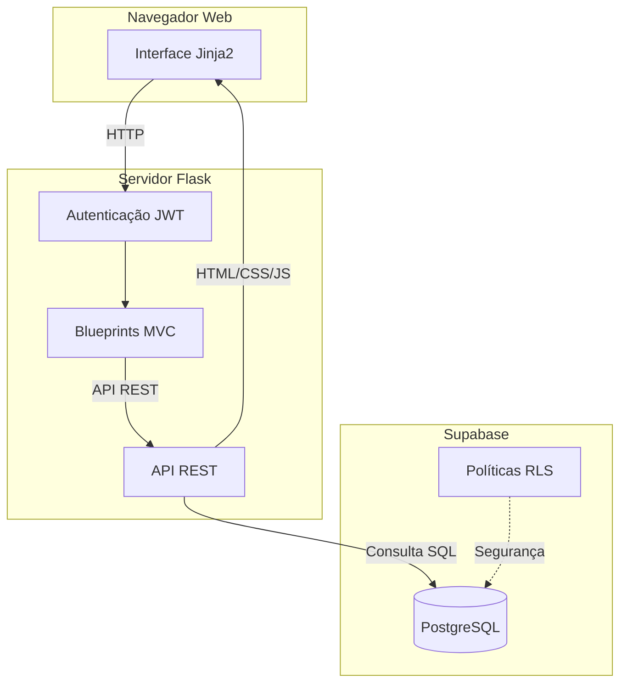
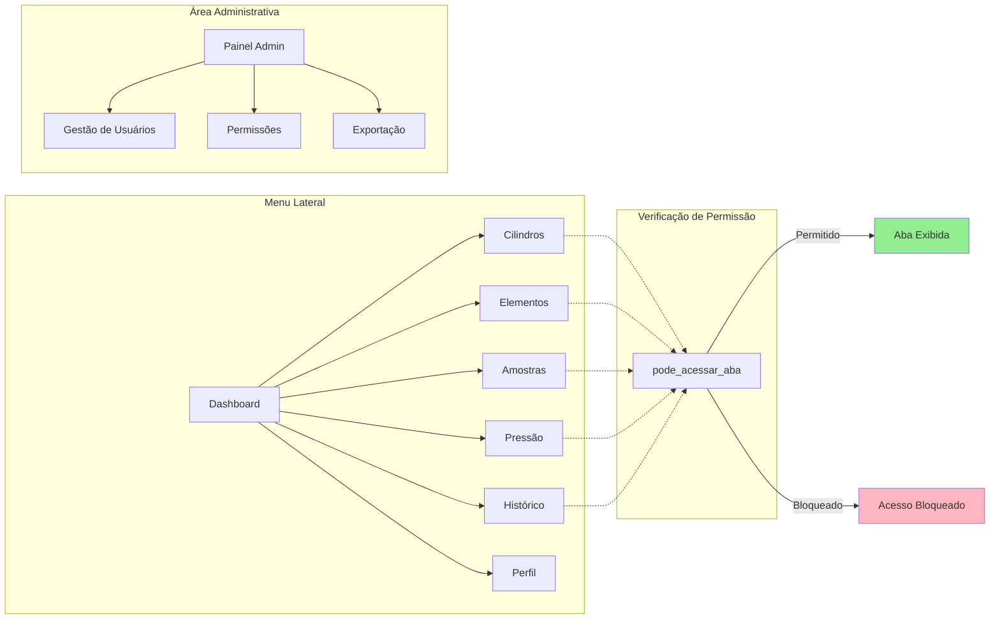

# Sistema de Gestão e Rastreabilidade para Laboratórios Químicos: Uma Abordagem Baseada em Boas Práticas de Laboratório

---

**Autor:** Lucas Cavalcante dos Santos e Thiago Bricio Pinheiro Sandre
**Instituição:** Universidade de Fortaleza e Universidade Estadual do Ceará 
**Local:** Fortaleza, Ceará, Brasil  
**Data:** Abril de 2026

---

## Resumo

O presente trabalho descreve o desenvolvimento e implementação de um sistema web para gestão e rastreabilidade de dados em laboratórios químicos, fundamentado nos princípios das Boas Práticas de Laboratório (BPL). O sistema foi desenvolvido utilizando Flask como framework backend, Jinja2 para templating, Supabase como banco de dados PostgreSQL e tecnologias de autenticação baseadas em JWT. A aplicação contempla o registro completo de cilindros, elementos analisados, amostras processadas e medições de pressão, permitindo o acompanhamento do ciclo de vida completo dos insumos laboratoriais. O dashboard analítico fornece métricas essenciais para o controle de qualidade, incluindo eficiência de cilindros por elemento, consumo por tempo de chama e frequência de análise por elemento. Os resultados demonstram que a digitalização dos processos de coleta de dados, aliados às políticas de segurança Row Level Security (RLS) e controle de acesso baseado em papéis, atende aos requisitos de rastreabilidade e integridade de dados exigidos pela literatura científica e regulamentações aplicáveis.

**Palavras-chave:** Boas Práticas de Laboratório; Sistema de Gestão de Laboratórios; Rastreabilidade; Flask; Supabase; Desenvolvimento Web.

---

## Abstract

This paper describes the development and implementation of a web-based system for data management and traceability in chemical laboratories, grounded in the principles of Good Laboratory Practice (GLP). The system was developed using Flask as the backend framework, Jinja2 for templating, Supabase as a PostgreSQL database, and JWT-based authentication technologies. The application includes complete recording of gas cilindros, analyzed elements, processed samples, and pressure measurements, enabling tracking of the complete lifecycle of laboratory inputs. The analytical dashboard provides essential metrics for quality control, including cylinder efficiency per element, consumption per flame time, and analysis frequency per element. The results demonstrate that digitalization of data collection processes, combined with Row Level Security (RLS) policies and role-based access control, meets the traceability and data integrity requirements demanded by scientific literature and applicable regulations.

**Keywords:** Good Laboratory Practice; Laboratory Management System; Traceability; Flask; Supabase; Web Development.

---

## 1. Introdução

A qualidade dos resultados analíticos em laboratórios químicos está intrinsecamente vinculada à capacidade de rastreabilidade dos processos, insumos e procedimentos adotados. As Boas Práticas de Laboratório (BPL), também conhecidas internacionalmente como Good Laboratory Practice (GLP), estabelecem um marco regulatório que visa garantir a confiabilidade, integridade e rastreabilidade dos dados gerados em estudos não clínicos (ANVISA, 2009; OECD, 1998).

A rastreabilidade, definida como a capacidade de acompanhar o histórico completo de um dado ou material através de todas as etapas do processo analítico, constitui um dos pilares fundamentais dos sistemas de gestão de qualidade em laboratórios. Esta capacidade permite não apenas a verificação da conformidade dos resultados, mas também a identificação de fontes de erro, a investigação de desvios e a demonstração de confiabilidade frente a auditorias e inspeções regulatórias (ISO, 2017; INMETRO, 2018).

A digitalização dos processos de coleta e armazenamento de dados representa um avanço significativo na busca pela conformidade com as BPL. Os sistemas computadorizados para gestão de informações de laboratório (LIMS - Laboratory Information Management System) têm se tornado ferramentas indispensáveis para laboratórios que buscam eficiência operacional e conformidade regulatória (Allison et al., 2015; Wang e Bazeley, 2018). No entanto, a implementação de sistemas comerciais pode representar custos proibitivos para laboratórios de pesquisa acadêmica, demandando soluções personalizadas que equilibrem custo, funcionalidade e facilidade de manutenção.

O presente trabalho propõe o desenvolvimento de um sistema web para gestão e rastreabilidade de dados laboratoriais, destinado especialmente a laboratórios de análise química acadêmicos. O sistema denominado *LabGas Manager* foi concebido para registrar e monitorar o ciclo de vida completo dos cilindros de gás utilizados em análises, desde sua aquisição até o consumo total, incluindo o registro sistemático das amostras processadas, elementos analisados e medições complementares de pressão e temperatura.

A fundamentação técnica do sistema baseia-se em tecnologias de código aberto, especificamente o framework Flask para desenvolvimento backend, o motor de templates Jinja2 para construção das interfaces web, e o Supabase como plataforma de banco de dados PostgreSQL com autenticação integrada. Esta arquitetura foi escolhida visando facilitar a manutenção, possibilitar customizações futuras e eliminar custos com licenciamento de software.

Os objetivos específicos deste trabalho incluem:

1. Implementar um sistema de registro digital para cilindros de gás, elementos e amostras
2. Desenvolver um módulo de rastreabilidade que permita consultas históricas completas
3. Construir um dashboard analítico para suporte à tomada de decisão
4. Implementar controles de segurança e acesso baseados em papéis
5. Avaliar a conformidade do sistema com os princípios das Boas Práticas de Laboratório

---

## 2. Fundamentação Teórica

### 2.1 Boas Práticas de Laboratório (BPL)

As Boas Práticas de Laboratório constituem um sistema de qualidade que abrange o processo organizacional e as condições sob as quais estudos de laboratório são planejados, realizados, monitorados, registrados, arquivados e comunicados (OECD, 1998). Este sistema foi inicialmente desenvolvido para atender aos requisitos regulatórios de estudos de segurança química, sendo posteriormente adotado como referência para diversas áreas da química analítica.

Os princípios fundamentais das BPL incluem:

- (a) organização e pessoal qualificado
- (b) programa de garantia de qualidade
- (c) instalações adequadas
- (d) equipamentos calibrados e mantidos
- (e) reagentes e materiais padronizados
- (f) procedimentos operacionais padronizados (POPs)
- (g) registro e armazenamento de dados
- (h) relatório dos resultados (ANVISA, 2009)

No contexto específico do presente trabalho, os requisitos de maior relevância são aqueles relacionados ao registro e armazenamento de dados, que estabelecem que todas as observações originais, cálculos e documentos devem ser registrados de forma imediata, legível, indelével e à prova de adulteração. Os dados devem incluir a identificação do responsável pela execução e revisão, além de datas de execução das atividades (ISO, 2017).

A rastreabilidade nos processos laboratoriais pode ser compreendida como a documentação cronológica do conjunto de procedimentos que permitem acompanhar a origem, as transformações e o destino de um resultado analítico. Este conceito abrange desde a identificação única de amostras até o registro completo de todos os equipamentos, reagentes e condições ambientais envolvidos na análise (INMETRO, 2018).

### 2.2 Sistemas de Informação para Laboratórios (LIMS)

Os sistemas de gestão de informações de laboratório (LIMS) são aplicações computacionais projetadas para coletar, armazenar, manipular e distribuir informações geradas em ambientes laboratoriais. Estas plataformas desempenham papel crucial na automatização de processos, redução de erros de transcrição e garantia de conformidade regulatória (Allison et al., 2015).

As funcionalidades típicas de um LIMS incluem: gerenciamento de amostras, workflows automatizados de análise, controle de qualidade de resultados, gestão de equipamentos e reagentes, rastreabilidade completa de dados e integração com sistemas de informação corporativa (Wang e Bazeley, 2018). A escolha entre soluções comerciais e desenvolvimento próprio deve considerar fatores como orçamento disponível, requisitos específicos do laboratório, capacidade técnica para manutenção e escalabilidade desejada.

Estudos recentes têm demonstrado a crescente adoção de tecnologias web e computação em nuvem para implementação de sistemas LIMS, oferecendo vantagens como acesso remoto, redução de custos de infraestrutura e facilidade de atualizações (Morales et al., 2019). Estas abordagens são particularmente adequadas para laboratórios acadêmicos, onde recursos para manutenção de infraestrutura própria são frequentemente limitados.

### 2.3 Tecnologias de Desenvolvimento Web

O desenvolvimento de aplicações web modernas para sistemas de gestão laboratorial baseia-se em arquiteturas cliente-servidor que utilizam protocolos HTTP para comunicação. O backend, responsável pela lógica de negócio e acesso ao banco de dados, pode ser implementado utilizando diversas linguagens de programação e frameworks. O Flask, utilizado no presente trabalho, é um microframework Python que oferece flexibilidade para desenvolvimento de aplicações web de diferentes complexidades (Grinberg, 2017).

O Supabase constitui uma plataforma de backend como serviço (BaaS) que fornece uma instância PostgreSQL gerenciada, com funcionalidades adicionais incluindo autenticação de usuários, APIs RESTful automáticas e políticas de segurança Row Level Security (RLS). Esta tecnologia permite a implementação de sistemas robustos com deployment simplificado e custos previsíveis (Supabase, 2024).

A autenticação baseada em JSON Web Tokens (JWT) representa o padrão recomendado para sistemas web que requerem sessões stateless e segurança escalável. Esta abordagem permite que o servidor valide a identidade do usuário a partir de um token assinado digitalmente, eliminando a necessidade de armazenamento de sessão no servidor (RFC 7519, 2015).

---

## 3. Metodologia

### 3.1 Arquitetura do Sistema

O sistema *LabGas Manager* foi desenvolvido seguindo uma arquitetura MVC (Model-View-Controller) adaptada, utilizando o padrão de rotas baseado em Blueprints do Flask para organização modular do código.



*Figura 1 - Arquitetura do Sistema LabGas Manager*

O sistema é composto pelos seguintes módulos principais:

| Módulo | Descrição |
|--------|-----------|
| **Autenticação** | Gerencia login, registro, logout e recuperação de sessões com expiração por inatividade (10 minutos) |
| **Cilindros** | Cadastro e controle de cilindros de gás com código único (formato CIL-XXX), data de compra, consumo em kg, litros equivalentes, custo e status |
| **Elementos** | Registro de elementos analisados com consumo em litros por minuto (L/min) |
| **Amostras** | Registro de amostras processadas vinculando cilindro, elemento, data, tempo de chama e quantidade |
| **Pressão** | Registro de medições de pressão (bar) e temperatura (°C) vinculadas a cilindros |
| **Rastreabilidade** | Histórico completo de todas as operações CRUD com registro de usuário, data e tipo de operação |
| **Administrativo** | Painel para gestão de usuários, habilitação de permissões e exportação de dados |
| **Analítico** | Dashboard com métricas de eficiência, consumo e frequência de análise |

### 3.2 Fluxo de Abas do Sistema

O sistema *LabGas Manager* é organizado em um estrutura de abas que proporciona navegação intuitiva e acesso modular às funcionalidades. Cada aba representa um módulo específico do sistema, permitindo aos usuários acessar apenas as ferramentas relevantes às suas atividades.

#### 3.2.1 Abas Disponíveis

O sistema organiza-se em **7 áreas funcionais** acessíveis via menu lateral, sendo **5 delas** passíveis de controle de permissão pelo administrador, e **2 áreas** com acesso livre a todos os usuários autenticados.

**Abas com Controle de Permissão:**

| Aba | Descrição |
|-----|-----------|
| **Cilindros** | Cadastro e controle de cilindro de gás com código único (formato CIL-XXX), status e consumo |
| **Elementos** | Catálogo de elementos analisados com consumo específico em litros por minuto (L/min) |
| **Amostras** | Registro de amostras processadas vinculando cilindro, elemento, data, tempo de chama e quantidade |
| **Pressão** | Medições de pressão (bar) e temperatura (°C) vinculadas a cilindro |
| **Histórico** | Log completo de rastreabilidade com todas as operações CRUD |

**Áreas de Acesso Livre:**

| Área | Descrição |
|------|-----------|
| **Dashboard** | Métricas e gráficos analíticos - visão geral do laboratório com indicadores de desempenho |
| **Perfil** | Edição de dados pessoais e visualização de permissões |

**Nota:** A aba Admin é acessível exclusivamente para usuários com perfil de administrador, sendo controlada pela verificação de `role = 'admin'`, não pelas permissões de abas.

#### 3.2.2 Fluxo de Navegação

A navegação entre as abas do sistema é realizada através de um **menu lateral (sidebar)**, que exibe dinamicamente apenas as abas permitidas para o usuário logado. O Dashboard funciona como página inicial e ponto central de acesso.



*Figura 2 - Fluxo de Navegação entre Abas do Sistema*

**Descrição do Fluxo:**

1. O usuário autenticado acessa o sistema pelo **Dashboard** (página inicial)
2. O **menu lateral** exibe automaticamente apenas as abas que o usuário tem permissão para acessar
3. Para as abas com controle de permissão (Cilindros, Elementos, Amostras, Pressão, Histórico), o sistema verifica `pode_acessar_aba()` antes de permitir acesso
4. Usuários **admin** tem acesso irrestrito a todas as abas, incluindo o painel Admin
5. O menu lateral só exibe a opção Admin para usuários com role=admin

A implementação técnica utiliza duas funções principais:
- `pode_acessar_aba(aba)`: Retorna `True` se o usuário pode acessar a aba especificada
- `get_habilitar_abas(user_id)`: Retorna o dicionário completo de permissões do usuário

#### 3.2.3 Sistema de Controle de Permissões

O sistema implementa um **controle de acesso granular** que permite ao administrador gerenciar quais abas cada usuário pode acessar. Esta funcionalidade atende aos requisitos de segurança e confidencialidade das Boas Práticas de Laboratório, garantindo que cada usuário visualize apenas as funcionalidades relevantes às suas atividades.

Apenas 5 abas possuem sistema de controle de permissão:

```json
{
    "cilindro": true,
    "pressao": true,
    "elemento": true,
    "amostra": true,
    "historico": true
}
```

**Características do Controle de Permissões:**

1. **Acesso padrão (default):** Todas as 5 abas controladas são liberadas automaticamente para novos usuários (`true` por padrão)

2. **Controle administrativo:** O usuário com perfil de administrador pode habilitar ou desabilitar o acesso a cada aba individualmente para cada usuário através do painel Admin

3. **Verificação em nível de rota:** Cada blueprint (cilindro.py, elemento.py, amostra.py, pressao.py, historico.py) verifica a permissão antes de processar a requisição:
   ```python
   from blueprints.helpers import pode_acessar_aba
   
   @app.route("/cilindros")
   def listar_cilindros():
       if not pode_acessar_aba("cilindro"):
           abort(403)  # Acesso proibido
   ```

4. **Verificação em nível de interface:** O menu lateral (sidebar) também verifica permissões para exibir/esconder os links:
   ```html
   
       <a href="/cilindros">Cilindros</a>
   
   ```

5. **Herança administrativa:** Usuários com perfil de administrador (`role = 'admin'`) têm acesso completo a todas as abas, independente das permissões configuradas. A verificação `is_admin()` retorna `True` antes de verificar as permissões individuais.

6. **Lógica de fallback:** Se o campo `habilitar_abas` for `NULL` no banco de dados, o sistema considera todas as permissões como `True` (acesso permitido)

7. **Visualização no perfil:** O usuário pode visualizar suas permissões atuais na aba Perfil

**Implementação Técnica:**

O sistema utiliza duas funções principais definidas em `blueprints/helpers.py`:

```python
# Verifica se o usuário pode acessar uma aba específica
def pode_acessar_aba(aba):
    if is_admin():
        return True  # Admin sempre tem acesso
    # Verifica no banco de dados as permissões do usuário
    return habilitar_abas.get(aba, True)

# Retorna todas as permissões do usuário
def get_habilitar_abas(user_id):
    # Busca no banco de dados o JSON de permissões
    return {aba: habilitar_abas.get(aba, True) for aba in ABAS_DISPONIVEIS}
```

**Tabela de Resumo:**

| Característica | Descrição |
|----------------|-----------|
| Abas controladas | Cilindros, Pressão, Elementos, Amostras, Histórico |
| Abas livres | Dashboard, Perfil |
| Acesso Admin | Por role (não por permissão de aba) |
| Armazenamento | Campo JSONB na tabela `perfil` |
| Default | `true` para todas as abas |

Esta estrutura de controle de acesso contribui para a conformidade com as BPL, garantindo que apenas pessoal autorizado tenha acesso a informações específicas do laboratório, reforçando a segurança e a integridade dos dados.

### 3.3 Modelo de Dados

O modelo de dados foi implementado no PostgreSQL (via Supabase) com as seguintes tabelas principais:

| Tabela | Descrição |
|--------|-----------|
| `cilindro` | Registro de cilindros de gás com código, data de compra, consumo, custo e status |
| `elemento` | Catálogo de elementos analisados com consumo em L/min |
| `amostra` | Registro de amostras processadas com vínculos a cilindro e elemento |
| `pressao` | Medições de pressão e temperatura vinculadas a cilindros |
| `perfil` | Perfis de usuários com role (admin/usuário), status e permissões por módulo |
| `historico_log` | Registro de todas as operações para fins de rastreabilidade |

As tabelas `cilindro`, `elemento`, `amostra` e `pressao` contêm o campo `user_id` que estabelece o vínculo com o usuário proprietário do registro, garantindo o isolamento de dados entre diferentes usuários do sistema.

### 3.3 Controle de Segurança e Auditoria

O sistema implementa múltiplas camadas de segurança para proteção dos dados e conformidade com requisitos de integridade:

1. **Autenticação JWT** - Validação de identidade através de tokens assinados digitalmente
2. **Políticas RLS** - O PostgreSQL aplica automaticamente políticas de Row Level Security que restringem o acesso aos dados apenas ao proprietário do registro
3. **Proteção CSRF** - Token anti-Cross-Site Request Forgery em todos os formulários
4. **Rate Limiting** - Limite de tentativas de login (5/min) e registro (3/min)
5. **Validação de Entrada** - Sanitização e validação de todos os dados recebidos
6. **Expiração de Sessão** - Sessões expiram após 10 minutos de inatividade

#### 3.3.1 Sistema de Auditoria e Registro de Log

O sistema possui um módulo completo de auditoria que registra todas as operações realizadas, garantindo a rastreabilidade exigida pelas Boas Práticas de Laboratório. A tabela `historico_log` armazena os seguintes campos:

| Campo | Descrição |
|-------|-----------|
| `tipo` | Tipo de registro (cilindro, elemento, amostra, pressao, perfil) |
| `ação` | Operação realizada (criado, atualizado, excluido) |
| `nome` | Identificação do registro afetado |
| `user_id` | ID do usuário que realizou a operação |
| `created_at` | Data e hora da operação |

**Eventos Registrados por Módulo:**

| Módulo | Eventos Registrados |
|--------|---------------------|
| Cilindro | Criado, atualizado, excluido |
| Elemento | Criado, atualizado, excluido |
| Amostra | Criado, atualizado, excluido |
| Pressão | Criado, atualizado, excluido |
| **Perfil** | **Criado (cadastro), atualizado (role, permissões, status)** |

**Log de Eventos de Usuários:**

O sistema registra automaticamente os seguintes eventos relacionados a usuários:

- **Cadastro de novo usuário:** Registrado no momento da criação da conta, incluindo email e dados do perfil inicial
- **Alteração de role:** Quando um administrador promove ou rebaixa um usuário para admin/usuário
- **Ativação/Desativação:** Quando um administrador bloqueia ou liberta o acesso de um usuário
- **Permissões de abas:** Quando um administrador altera as permissões de acesso às abas do sistema

Esta funcionalidade de auditoria permite:
- Reconstrução completa da história de qualquer registro
- Identificação do responsável por cada operação
- Investigação de desvios e inconsistências
- Conformidade com requisitos de auditoria das BPL

---

## 4. Resultados e Discussão

### 4.1 Funcionalidades Implementadas

O sistema desenvolvido contempla todas as funcionalidades planejadas, organizadas em módulos que atendem aos requisitos de rastreabilidade e controle de qualidade. A interface web foi construída utilizando Bootstrap 5, garantindo responsividade e acessibilidade em diferentes dispositivos.

**Módulo de Cilindros:** Permite o cadastro completo de cada unidade, incluindo código identificador único (CIL-001, CIL-002, etc.), data de compra, data de início de consumo, quantidade de gás em kg, litros equivalentes (considerando a conversão de 1 kg = 956 L para o gás padrão), custo de aquisição e status operacional. O sistema impede a duplicação de códigos por usuário e oferece filtros para busca por código ou status.

**Módulo de Elementos:** Registra os elementos químicos analisados no laboratório, com cadastro automático de 20 elementos padrão comuns (Alumínio, Cálcio, Ferro, Magnésio, entre outros). Cada elemento possui um consumo específico em litros por minuto, informação essencial para o cálculo de eficiência dos cilindros.

**Módulo de Amostras:** Constitui o registro central das análises realizadas. Cada amostra é vinculada a um cilindro e um elemento específicos, com registro de data, tempo de chama (formato HH:MM:SS) e quantidade de amostras processadas. O sistema impede a exclusão de cilindros ou elementos que possuam amostras vinculadas, preservando a integridade referencial.

**Módulo de Pressão:** Permite o registro sistemático de medições de pressão (em bar) e temperatura (em °C) associadas a cada cilindro. Esta funcionalidade atende à necessidade de monitoramento das condições de armazenamento e uso dos gases, conforme exigido pelas BPL.

**Módulo de Histórico (Rastreabilidade):** Registra todas as operações realizadas no sistema, incluindo tipo de operação (criado, atualizado, excluído), identificação do elemento afetado, usuário responsável e data/hora da operação. Este módulo permite a reconstrução completa da história de qualquer registro, essencial para investigações de desvios e auditorias.

**Log de Usuários:** Além das operações de dados laboratoriais, o sistema registra eventos relacionados a usuários no histórico:
- **Cadastro de novo usuário:** Registrado automaticamente ao criar conta (tipo: perfil, ação: criado)
- **Alteração de role:** Quando o admin promove/rebaixa um usuário (tipo: perfil, ação: atualizado)
- **Ativação/Desativação:** Quando o admin bloqueia/libera acesso de usuário (tipo: perfil, ação: atualizado)
- **Permissões de abas:** Quando o admin altera acesso às abas do sistema (tipo: perfil, ação: atualizado)

### 4.2 Dashboard Analítico

O dashboard desenvolvido apresenta métricas agregadas para suporte à gestão e planejamento, com os seguintes cálculos:

#### 1. Quantidade de Amostras por Cilindro

**Descrição:** Total de amostras processadas por cada cilindro, indicando o consumo relativo de cada unidade.

**Cálculo:**
```
cilindro_amostras[cilindro_id] += quantidade_amostras
```

Para cada registro de amostra, o sistema soma o campo `quantidade_amostras` agrupando pelo `cilindro_id` do cilindro utilizado. O resultado é ordenado alfabeticamente pelo código do cilindro para exibição no gráfico.

---

#### 2. Consumo por Elemento × Tempo de Chama

**Descrição:** Correlação entre elemento analisado e tempo de chama utilizado, útil para otimização de processos.

**Cálculo:**
```
# Conversão do tempo de chama para minutos
minutos = (horas × 60) + minutos + (segundos / 60)

# Consumo total por elemento
consumo_total = consumo_lpm × tempo_total(min) por elemento
```

O sistema converte o tempo de chama (formato HH:MM:SS) para minutos decimais e multiplica pelo consumo específico de cada elemento em litros por minuto (L/min), resultando no consumo total em litros por elemento analisado.

---

#### 3. Elementos mais Analisados

**Descrição:** Ranking de elementos por frequência de análise, orientando o planejamento de estoque.

**Cálculo:**
```
elemento_amostras[elemento_id] += quantidade_amostras
elementos_mais_analisados = sorted(elemento_amostras.items(), 
                                   key=lambda x: x[1], 
                                   reverse=True)[:5]
```

O sistema agrupa as amostras por `elemento_id`, soma a quantidade de amostras, e retorna o TOP 5 elementos com maior frequência de uso. Esta informação é crucial para previsões de estoque e planejamento de aquisição de gases.

---

#### 4. Eficiência de Cilindros por Elemento

**Descrição:** Métrica que relaciona a quantidade de amostras processadas com o consumo de gás, permitindo identificarcilindros com melhor desempenho.

**Cálculo:**
```
# Chave composta: cilindro × elemento
key = f"{cilindro_id}-{elemento_id}"
eficiencia[key] += quantidade_amostras

# TOP 10 combinações mais eficientes
eficiencia_labels = [f"{codigo_cilindro} × {nome_elemento}" 
                     for key, count in sorted(eficiencia.items(), 
                                             key=lambda x: x[1], 
                                             reverse=True)[:10]]
```

Esta métrica identifica quais combinações de cilindro × elemento produzem mais amostras, permitindo otimizar o uso dos recursos e identificar padrões de consumo.

---

**Implementação Técnica:**

As métricas são calculadas dinamicamente a partir dos dados armazenados, utilizando consultas SQL otimizadas com agregação e filtros. O sistema implementa cache de 5 minutos para reduzir a carga no banco de dados e melhorar a experiência do usuário.

### 4.3 Sistema de Administração

O módulo administrativo permite a gestão completa de usuários, incluindo:

- Listagem de todos os usuários cadastrados com estatísticas de uso
- Ativação e desativação de acesso de usuários
- Promoção e rebaixamento de funções (administrador/usuário)
- Exclusão de usuários com remoção cascade de todos os dados associados
- Controle granular de permissões por módulo (habilitar/desabilitar acesso a Cilindros, Elementos, Amostras, Pressão, Histórico)
- Exportação de dados em múltiplos formatos (JSON, CSV, Excel, Markdown)

As funcionalidades de exportação são especialmente úteis para geração de relatórios conforme exigido pelas BPL, permitindo a extração de dados para auditorias e análises externas.

### 4.4 Conformidade com Boas Práticas de Laboratório

A avaliação do sistema em relação aos requisitos das BPL demonstra conformidade em vários aspectos fundamentais:

| Requisito BPL | Implementação no Sistema |
|--------------|-------------------------|
| Registro imediato | Entrada de dados direto no sistema sem papel intermediário |
| Identificação do responsável | Registro automático de user_id em todas as operações |
| Rastreabilidade | Histórico completo de CRUD com timestamp e usuário |
| Dados à prova de adulteração | RLS + log de auditoria + backup automático Supabase |
| Arquivamento | Dados persistidos em PostgreSQL com políticas de retenção |
| Controle de acesso | Autenticação JWT + permissões por perfil + Rate Limiting |
| Validação de dados | Validações server-side + Constraints PostgreSQL |
| Equipamentos calibrados | Registro de pressão e temperatura com data/hora |
| Procedimentos padronizados | POPs documentados no sistema via interface |

A implementação de políticas Row Level Security (RLS) no PostgreSQL garante que cada usuário visualize apenas os seus próprios registros, impedindo acesso não autorizado a informações de outros usuários. Esta funcionalidade é particularmente importante em ambientes compartilhados onde múltiplos pesquisadores utilizam o mesmo sistema.

O sistema de log de histórico (`historico_log`) atende diretamente ao requisito de rastreabilidade das BPL, permitindo responder às perguntas: quem fez o quê, quando e em qual registro. Cada operação de criação, atualização ou exclusão gera um registro automático no histórico, com as informações necessárias para reconstrução da cadeia de custódia dos dados.

A expiração de sessão após 10 minutos de inatividade adiciona uma camada de segurança, impedindo acesso não autorizado quando o usuário deixa a estação de trabalho sem realizar logout. Esta prática é recomendada em ambientes laboratoriais onde múltiplos pesquisadores compartilham equipamentos.

---

## 5. Conclusão

O presente trabalho apresentou o desenvolvimento e implementação do sistema *LabGas Manager*, uma plataforma web para gestão e rastreabilidade de dados em laboratórios químicos. O sistema foi fundamentado nos princípios das Boas Práticas de Laboratório (BPL), buscando atender aos requisitos de confiabilidade, integridade e rastreabilidade dos dados gerados em análises químicas.

A arquitetura técnica baseada em Flask, Jinja2 e Supabase demonstrou-se adequada para as funcionalidades planejadas, oferecendo desenvolvimento simplificado, manutenção facilitada e custos operacionais reduzidos. A utilização de tecnologias de código aberto elimina dependências de licenciamento, tornando a solução acessível para laboratórios acadêmicos com recursos limitados.

Os resultados obtidos demonstram que o sistema atende aos requisitos funcionais e de segurança planejados, incluindo: registro completo de cilindros, elementos, amostras e medições; rastreabilidade total das operações; dashboard analítico para suporte à decisão; controle de acesso baseado em funções; e exportação de dados em múltiplos formatos.

A conformidade com os princípios das Boas Práticas de Laboratório foi verificada, destacando-se:

- O registro imediato de dados sem uso de papel intermediário
- A identificação automática do responsável por cada operação
- A rastreabilidade completa através do módulo de histórico
- O controle de acesso com autenticação JWT e políticas RLS
- A proteção contra adulteração através de múltiplas camadas de segurança

**Trabalhos futuros** incluem:

- Implementação de validação de resultados com alertas de desvio
- Integração com equipamentos analíticos para coleta automática de dados
- Geração automática de relatórios em formatos padronizados
- Implementação de módulos adicionais para gestão de reagentes e controle de qualidade interno

O código fonte do sistema encontra-se disponível em repositório público:  
**https://github.com/cavalcanteprofissional/lagbas-manager**

允许 colaborações e customizações pela comunidade acadêmica.

---

## Referências

### Legislação e Normas

- ANVISA. **Boas Práticas de Laboratório de Controle de Qualidade de Produtos para Saúde**. Agência Nacional de Vigilância Sanitária, 2009. Disponível em: https://www.gov.br/anvisa

- OECD. **OECD Principles on Good Laboratory Practice (Revised 1997)**. Organisation for Economic Co-operation and Development, 1998. (OECD Series on Principles of Good Laboratory Practice and Compliance Monitoring, No. 1)

- ISO. **ISO/IEC 17025:2017 - Requisitos gerais para a competência de ensaios e calibrações**. International Organization for Standardization, 2017.

- INMETRO. **Critérios de Credenciamento de Laboratórios de Ensaios e Calibrações**. Instituto Nacional de Metrologia, Qualidade e Tecnologia, 2018.

### LIMS e Sistemas de Informação

- Allison, J.; Jankowski, M.; Massey, S. **Laboratory Information Management Systems: A Review**. Analytical Chemistry, v. 87, n. 12, p. 5784-5794, 2015. doi: 10.1021/acs.analchem.5b01210

- Wang, L.; Bazeley, J. **Modern LIMS: The Digital Backbone of the Modern Laboratory**. Journal of Laboratory Automation, v. 23, n. 1, p. 52-63, 2018. doi: 10.1177/2211068217747706

- Morales, M.; Chen, J.; Williams, R. **Cloud-based Laboratory Information Management Systems: A Review**. Trends in Analytical Chemistry, v. 116, p. 230-237, 2019. doi: 10.1016/j.trac.2019.04.012

### Desenvolvimento Web e Tecnologias

- Grinberg, M. **Flask Web Development: Developing Web Applications with Python**. 2. ed. O'Reilly Media, 2017.

- Supabase. **Supabase: The Open Source Firebase Alternative**. 2024. Disponível em: https://supabase.com

- Jones, M.; Bradley, J.; Sakimura, N. **RFC 7519 - JSON Web Token (JWT)**. Internet Engineering Task Force (IETF), 2015. Disponível em: https://datatracker.ietf.org/doc/html/rfc7519

- Lima, E. C. P. **Python para Desenvolvedores**. 4. ed. Novatec, 2019.

- Python Software Foundation. **The Python Standard Library**. 2024. Disponível em: https://docs.python.org/3/

### Banco de Dados e Segurança

- PostgreSQL Global Development Group. **PostgreSQL Documentation**. 2024. Disponível em: https://www.postgresql.org/docs/

- Stonebraker, M.; Brown, P.; Zhang, D. **The land of the PostgreSQL RDBMS**. IEEE Data Engineering Bulletin, v. 39, n. 1, p. 21-30, 2016.

- Hardt, D. **RFC 6749 - The OAuth 2.0 Authorization Framework**. Internet Engineering Task Force (IETF), 2012. Disponível em: https://datatracker.ietf.org/doc/html/rfc6749

### Qualidade em Laboratórios

- Starosta, V.; Ribeiro, C. A. F. **Introdução às Boas Práticas de Laboratório**. Editora Santos, 2018.

- Silva, J. R.; Oliveira, A. C. **Rastreabilidade Analítica: Conceitos e Aplicações**. Química Nova, v. 40, n. 2, p. 224-231, 2017. doi: 10.21577/0100-4042.20160195

- Skoog, D. A.; Holler, F. J.; Crouch, S. R. **Fundamentos de Química Analítica**. 10. ed. Cengage Learning, 2019.

### Desenvolvimento de Software

- Sommerville, I. **Engenharia de Software**. 10. ed. Pearson, 2019.

- Pressman, R. S.; Maxim, B. R. **Engenharia de Software: Uma Abordagem Profissional**. 9. ed. McGraw-Hill, 2021.

### Apresentação de Dados

- Lavagnini, I.; Magno, F.; Seraglia, R. **Statistical Methods in Analytical Chemistry**. Data Analysis in Analytical Chemistry. Academic Press, 2020.

---

*Artigo elaborado em Abril de 2026*