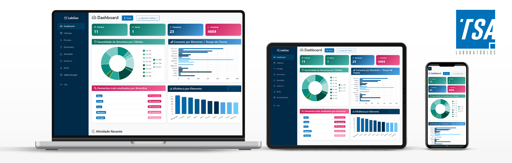
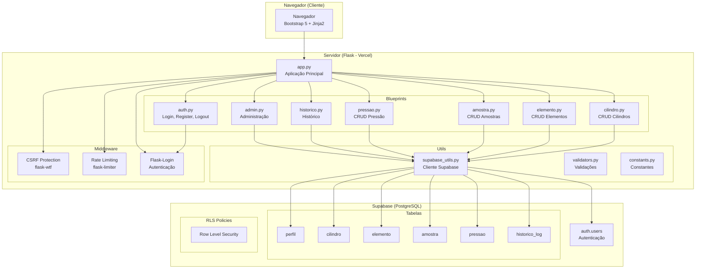
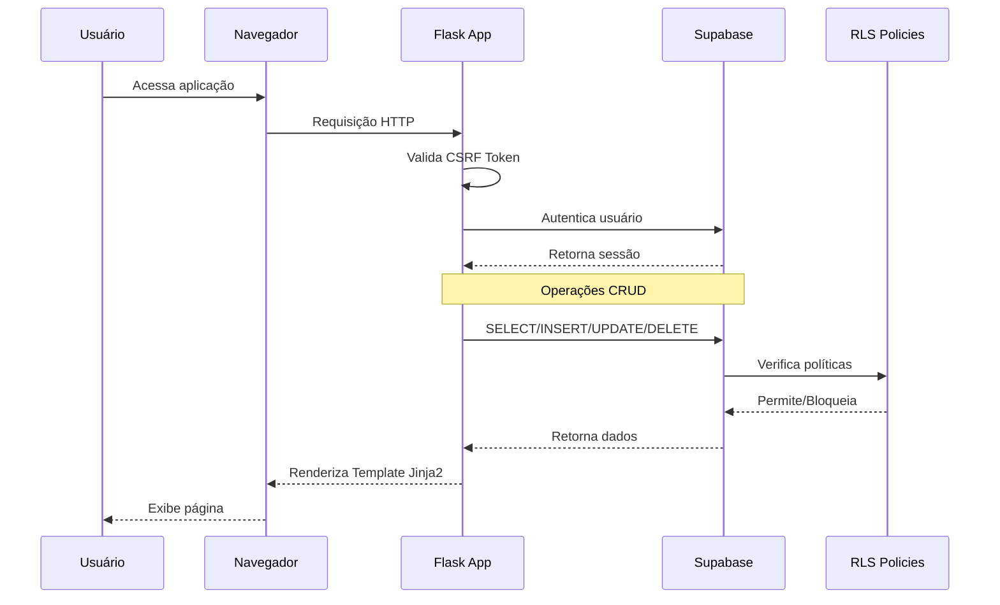
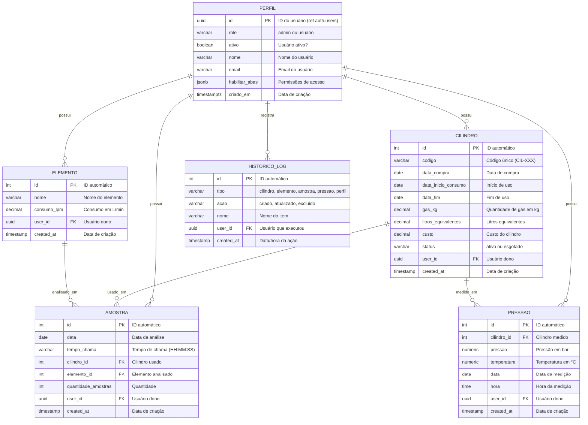
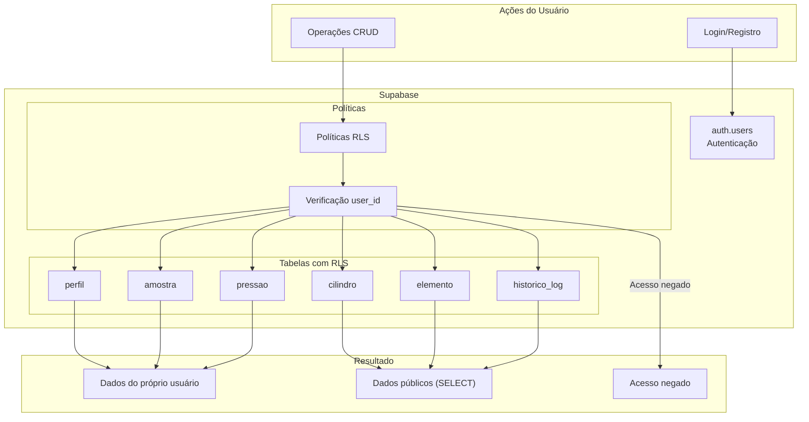

# LabGas Manager

**Versão: 2.1.0** (Branch: master)

Dashboard para gestão de cilindro de gás e elementos analisados em laboratório de química, utilizando **Flask** com **Jinja2** para o frontend web e **Supabase** como banco de dados PostgreSQL.



---

## Sistema de Cores v2.1.0

### Cor Primária
- **Principal**: `#0070b8` (derivada do ícone TSA)

### Paleta de Cores (CSS Variables)

| Variável | Hex | Uso |
|----------|-----|-----|
| `--primary-darkest` | #002a47 | Sidebar, textos escuros |
| `--primary-dark` | #003a5e | Sidebar hover, headers |
| `--primary` | #0070b8 | Brand, botões, elemento |
| `--primary-light` | #4da3e8 | Gradientes, cards |
| `--primary-lighter` | #6cccff | Gráficos, acentos |
| `--primary-lightest` | #88d4ff | Highlights |
| `--accent` | #005f96 | Cilindro (antigo) |
| `--accent-alt` | #4da3e8 | Elemento (antigo) |

### Paleta de Cores por KPI

| Variável | Hex | Uso |
|----------|-----|-----|
| `--green` | #00897b | Cilindros, Ativos, tags de cilindro |
| `--green-dark` | #00695c | Gradiente stat-card Cilindros |
| `--green-light` | #4db6ac | Gradiente stat-card Cilindros |
| `--pink` | #e91e63 | Amostras, tags de amostra |
| `--pink-dark` | #c2185b | Gradiente stat-card Amostras |
| `--pink-light` | #f06292 | Gradiente stat-card Amostras |
| `--purple` | #7b1fa2 | Tags de Consumo (L/min) |
| `--purple-light` | #ba68c8 | Tags de Qtd |
| `--yellow` | #f59e0b | Tag "Atualizado" (mesma cor do btn Editar) |
| `--red` | #dc3545 | Tag "Excluído" (mesma cor do btn Excluir) |
| `--orange` | #f59e0b | Pressões |
| `--orange-dark` | #d97706 | Gradiente stat-card Pressões |
| `--orange-light` | #fbbf24 | Gradiente stat-card Pressões |

---

## Recursos Principais

### Abas e Funcionalidades

| Aba | Funcionalidades |
|-----|-----------------|
| **Dashboard** | Cards com estatísticas, gráficos de amostras por cilindro, elementos mais analisados, eficiência de cilindro |
| **Cilindros** | CRUD completo, código CIL-XXX, status (ativo/esgotado) |
| **Pressão** | CRUD completo, pressão (bar), temperatura (°C), data e hora, vinculado a cilindro |
| **Elementos** | CRUD completo, consumo em L/min, 20 elementos padrão pré-carregados |
| **Amostras** | CRUD completo, vinculado a cilindro/elemento, tempo de chama, quantidade |
| **Histórico** | Log de todas as operações CRUD, filtros por tipo/ação |
| **Perfil** | Edição de nome, visualização de role e permissões |
| **Administração** | Painel admin, gerenciar usuários, controle de acesso por abas, exportar dados |

### Novidades v1.6.0

- **Exportação de Dados**: Admin pode exportar todo o banco de dados
  - Formatos: JSON, CSV, Excel (.xlsx), Markdown (.md)
  - Botão no dashboard disponível apenas para admin
- **Controle de Acesso por Abas**: Admin pode habilitar/desabilitar abas para cada usuário
  - Abas controladas: Cilindros, Elementos, Amostras, Histórico
  - Usuários admin sempre têm acesso a todas as abas

### Novidades v1.7.0

- **Correção RLS**: Uso de cliente autenticado para operações no banco
- **Mensagens de Erro Amigáveis**: Erros técnicos são convertidos para mensagens amigáveis

### Novidades v1.8.0

- **Expiração de Sessão**: Sessão expira após 10 minutos de inatividade
  - Usuário é redirecionado para login com mensagem explicativa

### Novidades v2.0.1

- **Log de Usuários no Histórico**: Registro automático de eventos de usuários
  - Cadastro de novo usuário (tipo: perfil, ação: criado)
  - Alteração de role admin/usuário (tipo: perfil, ação: atualizado)
  - Ativação/desativação de usuário (tipo: perfil, ação: atualizado)
  - Alteração de permissões de abas (tipo: perfil, ação: atualizado)
- **Visualizar Senha**: Ícone de alternância para mostrar/ocultar senha
  - Disponível nas telas de Login e Registro
  - Ícone de olho (bi-eye / bi-eye-slash)

### Novidades v1.9.3

- **Pressão sem Obrigatoriedade**: Campos de registro na aba Pressão agora são opcionais
  - Cilindro, Pressão, Data e Hora são campos facultativos
  - Usuário pode registrar apenas os dados disponíveis

### Novidades v1.9.2

- **Pressão com Temperatura**: Nova aba Pressão agora inclui campo de temperatura
  - Pressão em bar (entre 0 e 300)
  - Temperatura em °C (entre -50 e 100)
  - Data default como data atual
  - Hora editável (formato HH:MM)
  - Vinculado a cilindro cadastrado
  - Múltiplos registros por cilindro
  - Admin pode controlar acesso por abas

### Novidades v1.9.0

- **Nova Aba Pressão**: Registro de pressão dos cilindro (versão inicial)

### Recursos de Segurança v1.5.0

- Proteção CSRF em todos os formulários
- Rate Limiting (5 tentativas/min login, 3 tentativas/min register)
- Validação de role e status contra valores permitidos
- Verificação de propriedade antes de delete (proteção IDOR)
- Session fixation protection
- Cliente autenticado para operações RLS

---

## Tecnologias

- **Frontend**: Flask 3.0 + Jinja2 + Bootstrap 5 + Bootstrap Icons
- **Banco de Dados**: Supabase (PostgreSQL)
- **Autenticação**: Supabase Auth (via Flask-Login)
- **Gerenciamento de Dependências**: pip + venv
- **Deploy**: Vercel

---

## Arquitetura do Sistema

### Visão Geral

O LabGas Manager segue uma arquitetura **monolítica modular** utilizando **Flask** como framework web. A aplicação é dividida em **Blueprints** para organização do código, em que cada Blueprint representa um domínio de negócio (autenticação,cilindros, elementos, etc.). O banco de dados **Supabase** (PostgreSQL) fornece tanto o armazenamento de dados quanto a autenticação de usuários.

### Diagrama de Arquitetura



### Fluxo de Dados



### Componentes

#### Frontend (Flask + Jinja2)

| Componente | Descrição | Arquivo |
|------------|-----------|---------|
| app.py | Aplicação Flask principal, configurações globais | `frontend/app.py` |
| auth.py | Blueprint de autenticação (login, register, logout) | `frontend/blueprints/auth.py` |
| cilindro.py | CRUD de cilindro de gás | `frontend/blueprints/cilindro.py` |
| elemento.py | CRUD de elementos químicos | `frontend/blueprints/elemento.py` |
| amostra.py | CRUD de amostras analisadas | `frontend/blueprints/amostra.py` |
| pressao.py | CRUD de medições de pressão | `frontend/blueprints/pressao.py` |
| historico.py | Visualização de log de atividades | `frontend/blueprints/historico.py` |
| admin.py | Painel administrativo e exportação de dados | `frontend/blueprints/admin.py` |
| helpers.py | Funções auxiliares (get_user_id, is_admin, etc) | `frontend/blueprints/helpers.py` |

#### Utils

| Componente | Descrição | Arquivo |
|------------|-----------|---------|
| supabase_utils.py | Cliente Supabase (autenticado e admin) | `frontend/utils/supabase_utils.py` |
| validators.py | Funções de validação (safe_int, safe_float) | `frontend/utils/validators.py` |
| constants.py | Constantes do sistema (status, cores, elementos) | `frontend/utils/constants.py` |

#### Banco de Dados (Supabase)

| Tabela | Descrição | Relações |
|--------|-----------|----------|
| perfil | Dados do usuário (role, permissões) | 1:N com cilindro, elemento, amostra, pressao |
| cilindro | Cadastro de cilindro de gás | 1:N com amostra, pressao |
| elemento | Cadastro de elementos químicos | 1:N com amostra |
| amostra | Registros de análises realizadas | N:1 com cilindro, elemento |
| pressao | Medições de pressão | N:1 com cilindro |
| historico_log | Log de todas as operações | N:1 com perfil |

### Tecnologias

| Categoria | Tecnologia | Versão |
|----------|------------|--------|
| Framework Web | Flask | 3.0+ |
| Template Engine | Jinja2 | - |
| UI Framework | Bootstrap | 5.3 |
| Ícones | Bootstrap Icons | 1.11 |
| Banco de Dados | Supabase (PostgreSQL) | - |
| Autenticação | Supabase Auth | - |
| ORM/Cliente | Supabase Python | - |
| Segurança | flask-wtf (CSRF) | - |
| Rate Limiting | flask-limiter | - |
| Sessão | Flask-Login | - |
| Deploy | Vercel | - |

### Padrões de Projeto

- **Blueprints**: Modularização do código Flask por domínio
- **MVC**: Separação clara de Model (Supabase), View (Jinja2), Controller (Blueprints)
- **RLS**: Row Level Security no PostgreSQL para controle de acesso
- **Service Role**: Uso de chave de serviço para operações administrativas

---

## Arquitetura do Banco de Dados

### Visão Geral

O banco de dados do LabGas Manager utiliza **PostgreSQL** através do **Supabase**. A estrutura é composta por 6 tabelas principais, com relacionamentos definidos por meio de chaves estrangeiras e políticas de **Row Level Security (RLS)** para garantir que cada usuário visualize e manipule apenas os seus próprios dados.

### Schema



### Relacionamentos

| De | Para | Cardinalidade | Descrição |
|----|------|----------------|------------|
| cilindro.user_id | perfil.id | N:1 | Cada cilindro pertence a um usuário |
| elemento.user_id | perfil.id | N:1 | Cada elemento pertence a um usuário |
| amostra.user_id | perfil.id | N:1 | Cada amostra pertence a um usuário |
| amostra.cilindro_id | cilindro.id | N:1 | Cada amostra usa um cilindro |
| amostra.elemento_id | elemento.id | N:1 | Cada amostra usa um elemento |
| pressao.user_id | perfil.id | N:1 | Cada medição pertence a um usuário |
| pressao.cilindro_id | cilindro.id | N:1 | Cada medição é de um cilindro |
| historico_log.user_id | perfil.id | N:1 | Cada registro é de um usuário |

### Índices

O banco de dados possui índices otimizados para as operações mais frequentes:

| Tabela | Índice | Coluna(s) | Propósito |
|--------|--------|-----------|-----------|
| cilindro | idx_cilindro_user_id | user_id | Filtrar por usuário |
| cilindro | idx_cilindro_codigo | codigo | Busca por código |
| elemento | idx_elemento_user_id | user_id | Filtrar por usuário |
| elemento | idx_elemento_nome | nome | Busca por nome |
| amostra | idx_amostra_user_id | user_id | Filtrar por usuário |
| amostra | idx_amostra_cilindro_id | cilindro_id | Vincular cilindro |
| amostra | idx_amostra_elemento_id | elemento_id | Vincular elemento |
| amostra | idx_amostra_data | data | Filtrar por data |
| pressao | idx_pressao_user_id | user_id | Filtrar por usuário |
| pressao | idx_pressao_cilindro_id | cilindro_id | Vincular cilindro |
| pressao | idx_pressao_data | data | Filtrar por data |
| historico_log | idx_historico_log_user_id | user_id | Filtrar por usuário |
| historico_log | idx_historico_log_tipo | tipo | Filtrar por tipo |
| historico_log | idx_historico_log_created_at | created_at | Ordenação temporal |

### Políticas RLS (Row Level Security)

O banco de dados utiliza **Row Level Security** para garantir o isolamento de dados entre usuários. Cada tabela possui políticas específicas que determinam quais registros cada usuário pode acessar.

| Tabela | SELECT | INSERT | UPDATE | DELETE |
|--------|--------|--------|--------|--------|
| cilindro | Público (todos) | Próprio usuário | Próprio usuário | Próprio usuário |
| elemento | Público (todos) | Próprio usuário | Próprio usuário | Próprio usuário |
| amostra | Público (todos) | Próprio usuário | Próprio usuário | Próprio usuário |
| perfil | Próprio usuário | Próprio usuário | Próprio usuário | - |
| pressao | Público (todos) | Próprio usuário | Próprio usuário | Próprio usuário |
| historico_log | Público (todos) | Admin (service_role) | - | - |

### Fluxo de Dados do Banco



---

## Estrutura de Diretórios

```
labgas-manager/
├── .gitignore
├── AGENTS.md                  # Documentação técnica
├── README.MD                  # Este arquivo
├── LICENSE                    # Licença MIT
├── TODO.MD                    # Tarefas e histórico do projeto
│
├── database/                  # Banco de dados
│   ├── schema.sql            # CREATE TABLE + índices
│   ├── rls.sql              # Políticas RLS
│   ├── seed.sql             # Dados iniciais (elementos padrão)
│   └── DIAGRAM.MD           # Diagramas (ER, Fluxo)
│
├── frontend/                  # Aplicação Flask (Web)
│   ├── app.py               # Aplicação principal
│   ├── requirements.txt     # Dependências Python
│   ├── vercel.json         # Configuração de deploy
│   │
│   ├── blueprints/          # Blueprints Flask
│   │   ├── __init__.py
│   │   ├── auth.py          # Login, register, logout
│   │   ├── cilindro.py      # CRUD Cilindros
│   │   ├── pressao.py       # CRUD Pressão
│   │   ├── elemento.py     # CRUD Elementos
│   │   ├── amostra.py       # CRUD Amostras
│   │   ├── historico.py    # Histórico de atividades
│   │   ├── admin.py         # Funções administrativas
│   │   └── helpers.py       # Funções auxiliares
│   │
│   ├── utils/               # Utilitários
│   │   ├── __init__.py
│   │   ├── supabase_utils.py  # Cliente Supabase
│   │   ├── validators.py      # Validações
│   │   └── constants.py       # Constantes
│   │
│   ├── templates/          # Templates Jinja2
│   │   ├── base.html        # Template base
│   │   ├── login.html       # Página de login
│   │   ├── register.html    # Página de registro
│   │   ├── dashboard.html   # Dashboard principal
│   │   ├── cilindro.html    # Gerenciamento de cilindro
│   │   ├── pressao.html     # Gerenciamento de pressão
│   │   ├── elemento.html    # Gerenciamento de elementos
│   │   ├── amostra.html     # Gerenciamento de amostras
│   │   ├── historico.html   # Histórico de atividades
│   │   ├── perfil.html      # Perfil do usuário
│   │   ├── admin.html       # Painel administrativo
│   │   ├── admin_user_data.html  # Dados de usuário específico
│   │   └── voice_modal.html # Modal do assistente de voz
│   │
│   ├── static/              # Arquivos estáticos
│   │   ├── favicon.svg
│   │   └── js/
│   │       └── voice_assistant.js
│   │
│   ├── .env.example         # Exemplo de variáveis de ambiente
│   └── .env.local           # Variáveis de ambiente (não versionado)
│
├── backend/                  # Reservado para API REST futura
│   ├── app.py
│   ├── config.py
│   ├── requirements.txt
│   ├── Procfile
│   └── .env
│
└── latex/                    # Documentação LaTeX (artigo)
    ├── artigo.tex
    ├── referencias.bib
    └── figuras/
```

---

## Como Rodar Local

### Pré-requisitos

- Python 3.10+
- pip

### Instalação

```bash
# 1. Clonar o repositório e entrar na pasta frontend
cd frontend

# 2. Criar ambiente virtual
python -m venv venv

# 3. Ativar ambiente virtual (Windows)
venv\Scripts\activate

# 4. Instalar dependências
pip install -r requirements.txt
```

### Configuração

Crie o arquivo `frontend/.env.local` com as variáveis de ambiente:

```env
SECRET_KEY=sua_chave_secreta_aqui
SUPABASE_URL=https://seu-projeto.supabase.co

# Desenvolvimento local
SUPABASE_KEY=sua_chave_anon
SUPABASE_SERVICE_KEY=sua_service_role_key
```

**Nota**: A `service_role_key` é necessária para operações de admin (bypass RLS).

> **Nota sobre nomenclatura de variáveis**: O Supabase injeta variáveis com nomes diferentes na Vercel:
> - `SUPABASE_ANON_KEY` (em vez de `SUPABASE_KEY`)
> - `SUPABASE_SERVICE_ROLE_KEY` (em vez de `SUPABASE_SERVICE_KEY`)
> O código automaticamente detecta qual nome usar em cada ambiente.

> **Arquitetura de Configuração**: O projeto usa `.env.local` em vez de `.env` para manter as secrets separadas do repositório. O arquivo `.env.example` contém os placeholders. O `.gitignore` já está configurado para ignorar arquivos `.env.local`.

### Executar

```bash
python app.py
```

O frontend estará disponível em: `http://localhost:5000`

---

## Regras de Negócio

### Cilindro
- Código único por usuário
- Código deve seguir formato CIL-XXX (ex: CIL-001, CIL-002)
- Valores padrão: 1kg = 956L, R$290
- Status: ativo, esgotado

### Pressão
- Vinculado a cilindro existente
- Pressão em bar (entre 0 e 300)
- Temperatura em °C (entre -50 e 100), opcional
- Data default como data atual
- Hora editável (formato HH:MM)
- Múltiplos registros por cilindro

### Elemento
- Lista pré-carregada automática (20 elementos padrão)
- Consumo em L/min
- Nomes únicos por usuário (primeira letra maiúscula)

### Amostra
- Data default como data atual
- Tempo de chama editável (HH:MM:SS)
- Vincular a cilindro e elemento existentes
- Quantidade de amostras (inteiro)

---

## Funcionalidades Implementadas

### Geral
- Sistema de autenticação (login/register/logout)
- Dashboard com cards de estatísticas
- Paginação em todas as listas (10/25/50/100 itens por página)
- Filtros em listas de cilindro, elemento e amostra
- Sistema de cache (5 minutos)
- Toast notifications
- Design responsivo com Bootstrap 5

### CRUD
- Criação, edição e exclusão de Cilindros
- Criação, edição e exclusão de Elementos
- Criação, edição e exclusão de Amostras
- Multi-select com checkbox para exclusão em massa

### Admin
- Painel de administração com lista de usuários
- Ativar/Desativar usuários
- Promover/Rebaixar usuários (admin/usuario)
- Deletar usuário e todos os dados associados
- Visualizar dados de qualquer usuário
- Controle de acesso por abas
- Exportação de dados (JSON/CSV/Excel/Markdown)

### Histórico
- Registro de todas as operações CRUD
- Filtros por tipo (cilindro/pressao/elemento/amostra/perfil) e ação (criado/atualizado/excluido)
- Exibição do usuário que realizou a ação
- **Log de usuários**: Cadastro, alteração de role, ativação/desativação, permissões de abas

### Validações
- Não permitir duplicatas (código de cilindro, nome de elemento)
- Cilindro e elemento não podem ser excluídos se possuírem amostras vinculadas
- Validação de código de cilindro (CIL-XXX)
- Normalização de nomes de elementos
- **Mensagens de erro amigáveis**: Erros técnicos são convertidos para mensagens amigáveis

---

## Novidades v2.2.0

### Segurança e Melhorias

- **Rate Limiting Baseado em Sessão**: Agora usa sessão Flask (funciona em production serverless)
  - 5 tentativas de login → bloqueio de 1 minuto
  - 3 tentativas de registro → bloqueio de 1 minuto
  
- **Verificação de Usuário Ativo**: Usuários desativados (`ativo=False`) são impedidos de fazer login

- **CORS Configurável**: Nova variável `ALLOWED_ORIGINS` para especificar domínios permitidos

- **Cache no Context Processor**: Informações do usuário cacheadas na sessão (reduz consultas ao banco)

- **CASCADE Deletes**: Foreign keys com `ON DELETE CASCADE` no banco Supabase:
  - `amostra.cilindro_id` → delete em cascata
  - `amostra.elemento_id` → delete em cascata  
  - `pressao.cilindro_id` → delete em cascata

- **Tratamento de Erros Padronizado**: Uso de `formatar_erro_supabase()` em todos os blueprints

- **Correções de Bugs**:
  - Nome da função pressao renomeado para `list()` (consistência)
  - Removidos imports locais duplicados em auth.py
  - Lógica do register corrigida (bloco de bloqueio agora dentro do POST)
  - Syntax error corrigido em cilindro.py (except fora de try)

### Variáveis de Ambiente (Novas)

| Variável | Descrição | Padrão |
|---------|----------|-------|
| `ALLOWED_ORIGINS` | Domínios permitidos para CORS (separados por vírgula) | `"*"` |

---

## Changelog

| Versão | Descrição |
|--------|-----------|
| v2.2.0 | Rate limiting em sessão, verificação is_user_active, CORS configurável, CASCADE deletes, cache context processor |
| v2.1.0 | Sistema completo de paleta de cores por KPI |
| v2.0.2 | Correções de consistência frontend vs backend (pressao/temperatura), documentação database/ |
| v2.0.1 | Log de usuários no histórico (cadastro, role, permissões), visualizar senha |
| v2.0.0 | Novo padrão de cores #0070b8, UI modernizada |
| v1.9.3 | Remover obrigatoriedade dos campos na aba Pressão |
| v1.9.2 | Adicionar campo temperatura à aba Pressão |
| v1.9.1 | Renomear aba Temperatura para Pressão, ícone bi-activity |
| v1.9.0 | Nova aba Pressão - registro de pressão do cilindro |
| v1.8.0 | Sistema de expiração de sessão por inatividade (10 min) |
| v1.7.0 | Correções RLS, mensagens de erro amigáveis |
| v1.6.0 | Exportação de dados (JSON/CSV/Excel/Markdown) + Controle de acesso por abas |
| v1.5.0 | Correções de segurança (CSRF, IDOR, Rate Limiting, RLS) |
| v1.4.1 | Correções de UX e mensagens amigáveis, formatação de datas |
| v1.4.0 | Refatoração para Blueprints, código modular |

---

## Novidades v2.1.0

### Sistema de Paleta de Cores por KPI
Cada KPI (Cilindros, Elementos, Amostras, Pressões) agora possui cores padronizadas com gradientes.

### StatCards Padronizados
- **Cilindros/Ativos**: Verde (`stat-card green`)
- **Pressões**: Laranja (`stat-card orange`)
- **Elementos**: Azul (`stat-card blue`)
- **Amostras**: Rosa (`stat-card pink`)

### Tags Padronizadas por Tipo
- **Cilindro**: Tag verde (`var(--green)`)
- **Elemento**: Tag azul (`var(--primary)`)
- **Amostra**: Tag rosa (`var(--pink)`)
- **Pressão**: Tag amarelo (`#f59e0b`)

### Tags de Ação no Histórico
- **Criado**: Verde (`var(--green)`)
- **Atualizado**: Amarelo (`var(--yellow)`) - mesma cor do botão Editar
- **Excluído**: Vermelho (`var(--red)`) - mesma cor do botão Excluir

### Novas Variáveis CSS
- `--green`, `--green-dark`, `--green-light` - Cilindros
- `--pink`, `--pink-dark`, `--pink-light` - Amostras
- `--purple`, `--purple-light` - Consumo (L/min), Qtd
- `--yellow` - Tag "Atualizado"
- `--red` - Tag "Excluído"
- `--orange`, `--orange-dark`, `--orange-light` - Pressões

### Ordenação Alfabética
- Aba "Elementos" agora exibe elementos em ordem alfabética (A-Z)

### Correções Visuais
- Stat-card "Ativos" agora usa cor verde (antes roxo)
- Stat-card "Pressões" agora usa gradiente laranja verdadeiro (antes azul)
- Tags de código de cilindro em todas as abas
- Tags de elemento em azul em todas as abas

---

## Novidades v2.0.2

### Correções de Bugs
- **Inconsistência pressao/temperatura**: Corrige nomenclatura em templates admin
  - `user.temperaturas` → `user.pressoes`
  - `habilitar_abas.temperatura` → `habilitar_abas.pressao`
  - `aba="temperatura"` → `aba="pressao"`
- **Exportação Excel**: Corrige variável inexistente (`ws_temperaturas` → `ws_pressoes`)
- **Exportação CSV**: Adiciona campo pressão, corrige header "TEMPERATURAS" → "PRESSOES"
- **Exportação JSON**: Corrige chave "temperaturas" → "pressoes"
- **Delete usuário**: Adiciona remoção de registros de pressão e histórico ao excluir usuário

### Documentação
- Adiciona diretório `database/` com schema SQL
- Adiciona políticas RLS completas
- Adiciona diagrama em formato Mermaid

### Estrutura
- Remove diretórios vazios (`codigo/`, `figuras/`)

---

## Deploy Vercel (Frontend + Backend)

### Configuração do Projeto

1. **Conectar Repositório**
   - Acesse: https://vercel.com/new
   - Selecione "Import Project"
   - Escolha o repositório `labgas-manager`

2. **Configurações do Projeto**
   - Framework Preset: **Flask** (não Other ou Services)
   - Build Command: *(deixe vazio)*
   - Output Directory: *(deixe vazio)*
   - Install Command: *(deixe vazio)*

3. **Environment Variables**
   - `SECRET_KEY`: sua chave secreta (obrigatória)
   - As variáveis do Supabase são injetadas automaticamente pelo Supabase na Vercel:
     - `SUPABASE_URL` (automático)
     - `SUPABASE_ANON_KEY` (automático)
     - `SUPABASE_SERVICE_ROLE_KEY` (automático)

4. **Configurar Domains**
   - Branch `main`: labgas-manager.vercel.app (produção)
   - Branch `master`: labgas-manager.vercel.app (produção)

### Arquitetura de Deploy

O projeto usa `vercel.json` para fazer deploy de **dois serviços** em um único projeto:

| URL | Serviço | Descrição |
|-----|---------|-----------|
| `/` | Frontend | App Flask completo com UI Jinja2 |
| `/api/*` | Backend | API REST do diretório `backend/` |

### Estrutura de Arquivos para Deploy

```
labgas-manager/
├── vercel.json          # Configuração de build e rotas
├── frontend/
│   ├── app.py           # App Flask principal (UI + API completa)
│   ├── requirements.txt # Dependências do frontend
│   └── templates/       # Templates Jinja2
├── backend/
│   ├── app.py           # API Flask standalone
│   ├── requirements.txt # Dependências do backend
│   └── routes/          # Rotas da API
└── runtime.txt          # Python 3.11
```

---

## Licença

MIT
