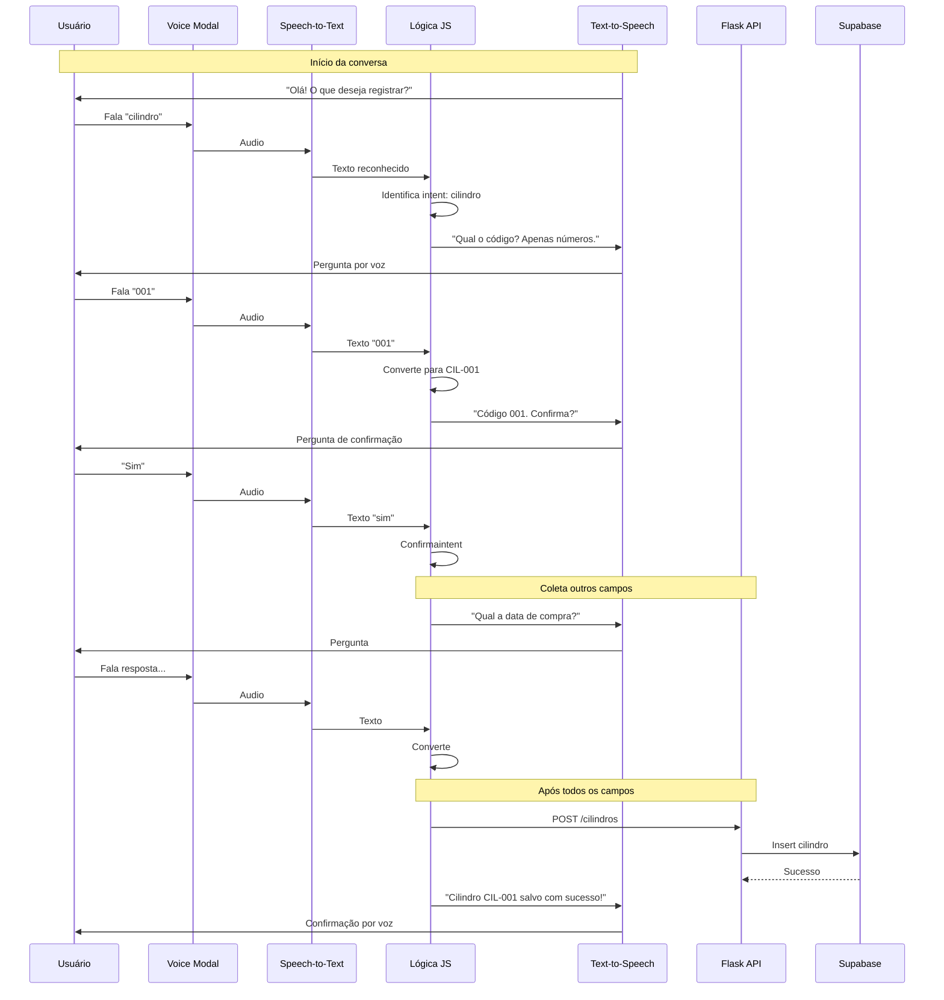

# Assistente de Voz - LabGas Manager

## Visão Geral

Sistema de assistente de voz para interação com o LabGas Manager, permitindo registro de dados (cilindros, pressão, elementos, amostras) através de comandos de voz, com respostas também em voz.

**Versão:** 2.0 - Completa
**Branch:** `feat/voice-assistant`

## Decisões de Implementação

| Decisão | Valor | Observação |
|---------|-------|-------------|
| **Processamento** | Frontend (JavaScript) | Sem API calls, mais rápido |
| **Escopo** | Cilindro, Pressão, Elemento, Amostra | Todas entidades implementadas |
| **Estado** | Client-side | JavaScript |
| **Fallback** | Voz + Texto | Hybrid |
| **Código cilíndro** | Ignora prefixo "CIL-", só números | "001" = CIL-001 |
| **Persistência** | Temporária durante conversa + Final no banco | Estado em memória JS + Insert no final |
| **Schema banco** | NÃO altera | Usa tabela existente |

---

## Fase 1: Cilindro Only (MVP)

```
┌─────────────────────────────────────────────────────────────────┐
│                    FRONTEND (Voice)                          │
├─────────────────────────────────────────────────────────────────┤
│  ┌─────────────┐    ┌──────────────┐    ┌─────────────────────┐  │
│  │  Dashboard  │───▶│ Voice Button │───▶│  Voice Assistant    │  │
│  │             │    │   (new)      │    │   Modal/Sidebar     │  │
│  └─────────────┘    └──────────────┘    └─────────┬───────────┘  │
│                                                  │              │
│  ┌──────────────────────────────────────────────▼───────────┐  │
│  │            Web Speech API (navegador)                   │  │
│  │  ┌─────────────────┐     ┌─────────────────────────────┐│  │
│  │  │ Speech-to-Text  │────▶│  Text-to-Speech (voz)       ││  │
│  │  │ (reconhecimento)│     │  (resposta do assistente)   ││  │
│  │  └─────────────────┘     └─────────────────────────────┘│  │
│  └─────────────────────────────────────────────────────────┘  │
│                                │                           │
│                                ▼                           │
│  ┌─────────────────────────────────────────────────────────┐  │
│  │     Estado em memória JS (temporário durante conversa)     │  │
│  │     { código: "...", data: "...", kg: "...", etc }    │  │
│  └─────────────────────────────────────────────────────────┘  │
│                                │                           │
│                                ▼ Insert no final             │
┌─────────────────────────────────────────────────────────────────┐
│                  FLASK BACKEND                                │
├─────────────────────────────────────────────────────────────────┤
│  /cilindros (POST)        → Insere cilindro no banco          │
└─────────────────────────────────────────────────────────────────┘

**Notas:**
- Todo processamento de intents em JavaScript (frontend)
- Estado tempor��rio em memória JavaScript durante conversa
- Insert único no final via rota existente /cilindros
- NÃO altera schema do banco de dados
- Outras entidades (Pressão, Elementos, Amostras) serão implementadas **depois**

---

## Fluxo de Dados - Fase 1: Cilindro Only



---

## Tecnologias Gratuitas

| Tecnologia | Uso | Custo |
|------------|-----|-------|
| **Web Speech API** | Reconhecimento de voz no navegador | Gratuito |
| **Web Speech API (SpeechSynthesis)** | Síntese de voz (resposta) | Gratuito |
| **Flask (Backend)** | Processamento de comandos | Gratuito |
| **Regex/NLP simples** | Interpretação de intents | Gratuito |
| **Supabase** | Armazenamento | Gratuito (tier free) |

---

## Fluxo de Conversação - Cilindro Only

```
╔════════════════════════════════════════════════════════════════════╗
║                    ASSISTENTE DE VOZ - LABGAS                    ║
╠════════════════════════════════════════════════════════════════════╣
║                                                                    ║
║  🎤 SISTEMA: "Olá! Sou seu assistente de voz do LabGas Manager." ║
║              "O que você gostaria de registrar?"                  ║
║                                                                    ║
║  📋 OPÇÕES:                                                       ║
║     1. Cilindro                                                   ║
║     (mais opções depois)                                         ║
║                                                                    ║
║  🎤 USUÁRIO: "Cilindro" ou "Um"                                 ║
║                                                                    ║
║  ═══════════════════════════════════════════════════════════════ ║
║                                                                    ║
║  🎤 SISTEMA: "Certo! Vou Registrar um novo cilindro."            ║
║              "Qual é o código?Apenas os números."                ║
║              "Exemplo: zero zero um"                              ║
║                                                                    ║
║  🎤 USUÁRIO: "001" ou "um"                                       ║
║                                                                    ║
║  ═══════════════════════════════════════════════════════════════ ║
║                                                                    ║
║  🎤 SISTEMA: "Código 001. Confirma? Diga sim ou não."           ║
║                                                                    ║
║  🎤 USUÁRIO: "Sim"                                               ║
║                                                                    ║
║  ═══════════════════════════════════════════════════════════════ ║
║                                                                    ║
║  [Continua com as próximas perguntas do formulário...]           ║
║    2. Data de compra                                              ║
║    3. Gás (kg)                                                    ║
║    4. Custo                                                       ║
║    5. Status (ativo/esgotado)                                     ║
║                                                                    ║
╚════════════════════════════════════════════════════════════════════╝
```
╔════════════════════════════════════════════════════════════════════╗
║                    ASSISTENTE DE VOZ - LABGAS                    ║
╠════════════════════════════════════════════════════════════════╣
║                                                                    ║
║  🎤 SISTEMA: "Olá! Sou seu assistente de voz do LabGas Manager." ║
║              "O que você gostaria de registrar?"                  ║
║                                                                    ║
║  📋 OPÇÕES:                                                       ║
║     1. Cilindros                                                   ║
║     2. Pressão                                                     ║
║     3. Elementos                                                   ║
║     4. Amostras                                                    ║
║                                                                    ║
║  🎤 USUÁRIO: "Quero registrar um cilindro" ou "Cilindro"         ║
║                                                                    ║
║  ═══════════════════════════════════════════════════════════════ ║
║                                                                    ║
║  🎤 SISTEMA: "Certo! Vou registrar um novo cilindro."             ║
║              "Qual é o código do cilindro?"                        ║
║              "Formato: CIL-001"                                  ║
║                                                                    ║
║  🎤 USUÁRIO: "CIL-001"                                            ║
║                                                                    ║
║  ═══════════════════════════════════════════════════════════════ ║
║                                                                    ║
║  🎤 SISTEMA: "Código CIL-001. Confirma? Diga sim ou não."        ║
║                                                                    ║
║  🎤 USUÁRIO: "Sim"                                                ║
║                                                                    ║
║  ═══════════════════════════════════════════════════════════════ ║
║                                                                    ║
║  [Continua com as próximas perguntas do formulário...]           ║
║                                                                    ║
╚════════════════════════════════════════════════════════════════════╝
```

---

## Estrutura de Arquivos a Criar - Fase 1

```
frontend/
├── app.py                                   # Ja existe (adicionar rota /voice)
├── blueprints/
│   └── voz.py                               # [NOVO] Voice assistant (opcional)
├── templates/
│   ├── dashboard.html                       # [MODIFICAR] Adicionar botão Voice
│   └── voice_modal.html                     # [NOVO] Modal do assistente
└── static/
    └── js/
        └── voice_assistant.js              # [NOVO] Lógica de voz
```

**Notas da Fase 1:**
- Não cria backend/分开 - usa rotas existentes
- Integração com /cilindros (POST) existente
- Todo processamento em JavaScript (client-side)

---

## Diagrama de Estados (State Machine) - Fase 1: Cilindro Only

```
┌──────────────┐
│   IDLE       │  ← Estado inicial, aguardando usuário
│   (sem dados)│
└──────┬───────┘
       │ Usuário fala "cilindro" ou "um"
       ▼
┌──────────────┐
│  INTENT      │  ← Identifica intenção:cilindro
│  (limpar dados)│
└──────┬───────┘
       │
       ▼
┌──────────────┐
│  COLLECTING  │  ← Coleta dados (perguntas uma a uma)
│  (armazena   │    ├── Pergunta 1: código → {codigo: "..."}
│   em JS)    │    ├── Pergunta 2: data → {data: "..."}
│              │    ├── Pergunta 3: kg → {gas_kg: "..."}
│              │    ├── Pergunta 4: custo → {custo: "..."}
│              │    └── Pergunta 5: status → {status: "..."}
└──────┬───────┘
       │ Dados coletados
       ▼
┌──────────────┐
│  CONFIRMING  │  ← Confirmação com o usuário
│  (dados ok) │
└──────┬───────┘
       │ Confirmação
       ▼
┌──────────────┐
│   EXECUTE    │  ← Chama API /cilindros (POST)
│  (insert DB) │    {codigo, data, gas_kg, custo, status}
└──────┬───────┘
       │ Sucesso/Erro
       ▼
┌──────────────┐
│   FEEDBACK   │  ← Retorna resultado por voz
│  (mostra ok) │
└──────┬───────┘
       │ Fim ou continuar
       ▼
┌──────────────┐
│   IDLE       │  ← Limpa memória, volta ao início
└──────────────┘
```

**Notas:**
- Dados armazenados em variável JavaScript durante conversa
- Insert único no banco apenas no estado EXECUTE
- Limpa memória após final (reset para IDLE)
┌──────────────┐
│   IDLE       │  ← Estado inicial, aguardando usuário
└──────┬───────┘
       │ Usuário fala "cilindro" ou "um"
       ▼
┌──────────────┐
│  INTENT      │  ← Identifica intenção:cilindro
└──────┬───────┘
       │
       ▼
┌──────────────┐
│  COLLECTING  │  ← Coleta dados (perguntas uma a uma)
│              │    ├── Pergunta 1: código (número)
│              │    ├── Pergunta 2: data
│              │    ├── Pergunta 3: kg
│              │    ├── Pergunta 4: custo
│              │    └── Pergunta 5: status
└──────┬───────┘
       │ Dados coletados
       ▼
┌──────────────┐
│  CONFIRMING  │  ← Confirmação com o usuário
└──────┬───────┘
       │ Confirmação
       ▼
┌──────────────┐
│   EXECUTE    │  ← Chama API existing /cilindros
└──────┬───────┘
       │ Sucesso/Erro
       ▼
┌──────────────┐
│   FEEDBACK   │  ← Retorna resultado por voz
└──────┬───────┘
       │ Fim ou continuar
       ▼
┌──────────────┐
│   IDLE       │  ← Volta ao início
└──────────────┘
```

---

## Endpoints da API - Fase 1

|Método|Endpoint|Descrição|
|------|--------|-----------|
|POST|`/cilindros`|Insere novo cilindro (rota existente)|

**Sem novos endpoints para Fase 1:**
- Todo processamento em JavaScript (frontend)
- Integração com rota existente `/cilindros` (POST)
- Dados temporários em memória JavaScript
- Insert único no banco apenas no final

---

## Persistência de Dados

### Estratégia: Temporária durante conversa + Final no banco

| Momento | Onde armazena | Como |
|---------|-------------|------|
| Durante conversa | Memória JavaScript | `let cilindroData = { codigo: "", data: "", ... }` |
| Final (EXECUTE) | Banco de dados | POST `/cilindros` |
| Após feedback | Limpa memória | `cilindroData = {}` |

### Por que NÃO altera schema?

1. **Rota existente** - `/cilindros` (POST) já insere no banco
2. **Dados temporários** - Apenas em memória JavaScript
3. **Insert único** - Um único POST no final
4. **Simplicidade** - Sem tabelas temporárias

### Estrutura do dados durante conversa

```javascript
// Estado global em memória JavaScript
let voiceState = {
    intent: "cilindro",     // Intenção atual
    data: {                 // Dados do cilindro
        codigo: "001",     // Formato: CIL-001
        data_compra: "2024-01-15",
        data_inicio_consumo: null,
        gas_kg: "1.0",
        custo: "290.00",
        status: "ativo"
    },
    currentStep: 0,           // Passo atual (0-5)
    confirmed: false          // Flag de confirmação
};
```

---

## Intenções (Intents) - v2.0: Completo

| Intent | Descrição | Parâmetros |
|--------|-----------|------------|
| `registrar_cilindro` | Cadastrar novo cilindro | código, data_compra, gas_kg, custo, status |
| `registrar_pressao` | Registrar pressão | cilindro_id, pressao, temperatura, data, hora |
| `registrar_elemento` | Cadastrar novo elemento | nome, consumo_lpm |
| `registrar_amostra` | Registrar análise | data, tempo_chama, cilindro_id, elemento_id, quantidade |

---

## Validações de Voz - Fase 1

| Campo | Validação | Exemplo de Resposta do Sistema |
|-------|-----------|--------------------------------|
| Código | Apenas números (3 dígitos) | "Código 001. Certo?" |
| Data | Formato de data (dia mês ano) | "Data não reconhecida. Diga a data no formato dia mês ano." |
| Gás (kg) | Decimal | "Quantos quilos?" |
| Custo | Decimal | "Qual o valor em reais?" |
| Status | ativo/esgotado | "Status ativo ou esgotado?" |

### Conversão de Código
- Entrada: "001" → Saída: "CIL-001"
- Entrada: "um" → Saída: "CIL-001"
- Entrada: "dois" → Saída: "CIL-002"

---

## Comandos de Voz Aceitos - Fase 1: Cilindro Only

### Afirmação
- "sim", "confirma", "correto", "certo", "ok", "yes", "y", "um"

### Negação
- "não", "nao", "cancelar", "errado", "não confirma", "no", "n"

### Navegação - Fase 1
- "cilindro", "registrar cilindro", "novo cilindro", "um"

### Números (para códigos e valores)
- "zero", "um", "dois", "três", "quatro", "cinco", "seis", "sete", "oito", "nove"
- "dez", "onze", "doze", "treze", "quatorze", "quinze"
- "vinte", "trinta", "quarenta", "cinquenta"
- "cem", "mil"

### Comandos das próximas fases (depois de Cilindro)
- "pressão", "registrar pressão", "pressão do cilindro"
- "elemento", "registrar elemento", "novo elemento"
- "amostra", "registrar amostra", "nova amostra"
- "cancelar", "voltar", "menu principal"

---

## Interface Visual (Frontend)

### Botão no Dashboard
- Posição: Ao lado do botão "Exportar Dados"
- Ícone: Microfone (bi-mic)
- Cor: Gradiente primário (#0070b8)
- Tooltip: "Assistente de Voz"

### Modal do Assistente
```
┌─────────────────────────────────────────────────────────────┐
│  ASSISTENTE DE VOZ - LABGAS                              [X]│
│─────────────────────────────────────────────────────────────│
│                                                             │
│  🎤 ┌─────────────────────────────────────────────────────┐ │
│     │  Ouvindo...                                        │ │
│     │  🎵 (animação de ondas)                           │ │
│     └─────────────────────────────────────────────────────┘ │
│                                                             │
│  📋 Histórico da conversa:                                  │
│     → Sistema: "O que deseja registrar?"                   │
│     → Você: "Quero registrar um cilindro"                 │
│     → Sistema: "Qual o código?"                             │
│                                                             │
│  ┌─────��────────────────────────────────────────────────┐  │
│  │  [🔴 Parar]  [⏸ Pausar]  [🔊 Volume]                 │  │
│  └──────────────────────────────────────────────────────┘  │
└─────────────────────────────────────────────────────────────┘
```

---

## Cronograma de Implementação

|Fase|Descrição|Prioridade|Notas|
|----|-----------|------------|-------|
|**Fase 1**|Configuração básica - Web Speech API + botão no dashboard|Alta|Apenas Cilindro|
|**Fase 2**|Estado IDLE - Início da conversa + lista de opções|Alta|Apenas Cilindro|
|**Fase 3**|Intent detection - Identificar intenção do usuário|Alta|Apenas Cilindro|
|**Fase 4**|Fluxo Cilindro - CRUD completo por voz|Alta|PRIMEIRA funcionalidade completa|
|**Fase 5**|Fluxo Pressão - Registro por voz|Média|depois de Cilindro|
|**Fase 6**|Fluxo Elemento - CRUD por voz|Média|depois de Cilindro|
|**Fase 7**|Fluxo Amostra - Registro por voz|Média|depois de Cilindro|
|**Fase 8**|Feedback visual + histórico no modal|Média|depois de Cilindro|
|**Fase 9**|Testes e ajustes de usabilidade|Média|depois de Cilindro|

---

## Melhorias Recomendadas para Compreensão (v2.0)

### ✅ Implementadas

| # | Melhoria | Status |
|---|----------|--------|
| 1 | Histórico visual | ✅ Implementado |
| 2 | Instruções claras | ✅ Implementado |
| 3 | Retry counter | ✅ Implementado |
| 4 | Matching flexível | ✅ Implementado |
| 5 | Normalização | ✅ Implementado |

### Upgrade v3.0: Whisper.cpp (Planejado)

| # | Melhoria | Descrição |
|---|----------|------------|
| 1 | Biblioteca | transcribe.js (whisper.cpp wasm) |
| 2 | Modelo | tiny-pt (português) - quando disponível |
| 3 | Precisão | Muito superior ao Web Speech API |
| 4 | Privacy | 100% local (nenhuma cloud) |
| 5 | Tamanho | ~75MB (download único) |

### Upgrade v3.0: Melhorias Imediatas (Alternativa Prática)

Devido à complexidade de configurar Whisper com modelos PT-BR, implementamos melhorias práticas:

| # | Melhoria | Descrição |
|---|----------|------------|
| 1 | Botões de seleção | Para status (Ativo/Esgotado) |
| 2 | Input manual sempre visível | Fallback quando voz falha |
| 3 | Instruções por áudio | Exemplos claros |
| 4 | Números por botões | 0-100 |

### Como Funcionará

```
Usuário fala → Microfone → Whisper (wasm) → Texto
```

### Recursos Necesários

| Recurso | URL |
|---------|-----|
| Package | `@transcribe/shout` + `@transcribe/transcriber` |
| Modelo PT | huggingface.co/ggerganov/whisper.cpp (modelos tiny/medium) |

### Limitações

- ⚠️ Download do modelo (~75MB) na primeira vez
- ⚠️ processador precisa suportar wasm
- ⚠️ Firefox tem suporte limitado

---

### 1. Sistema de Intents Melhores

| Currently | Proposed |
|-----------|----------|
| `matchAny(text, ['cilindro', ...])` | Matching por整句 ou palavras-chave no início |

### 2. Parser de Números

| Currently | Proposed |
|-----------|----------|
| Simples mapping | Suporte a números compostos ("vinte e um") |
| Case-sensitive | Normalizar para minúsculas |

### 3. Feedback Visual

| Currently | Proposed |
|-----------|----------|
| Apenas voz | Voz + texto no histórico |
| Estado só no console | Estado visível no modal |

### 4. Fluxo de Conversa Aprimorado

| Currently | Proposed |
|-----------|----------|
| Uma pergunta por vez | Confirmação após cada campo |
| Sem retry | 3 tentativas antes de reset |

### 5. Logging

| Currently | Proposed |
|-----------|----------|
| `console.log` | Histórico visível no modal |

---

## Escopo - O que NÃO faz parte da Fase 1

**Adiado para depois:**
- Registro de Pressão por voz
- Registro de Elementos por voz
- Registro de Amostras por voz
- Consulta/Listagem por voz
- Edição por voz
- Exclusão por voz
- Backend API para voz

---

## TestesNecessários

| Teste | Navegador |
|-------|-----------|
|Suporte completo|Chrome, Edge|
|Suporte parcial|Firefox (verificar)|
|Limitações|Safari/iOS|
|Sem permissão de microfone|Testar rejeição elegante|
|Offline temporário|Verificar comportamento|

---

## Scripts de Exemplo

### Detecção de Suporte

```javascript
function isSpeechSupported() {
  return 'SpeechRecognition' in window || 'webkitSpeechRecognition' in window;
}
```

### Iniciar Reconhecimento

```javascript
const recognition = new (window.SpeechRecognition || window.webkitSpeechRecognition)();
recognition.lang = 'pt-BR';
recognition.interimResults = false;
recognition.maxAlternatives = 1;

recognition.onresult = (event) => {
  const transcript = event.results[0][0].transcript;
  processVoiceInput(transcript);
};
```

### Síntese de Voz

```javascript
function speak(text) {
  const utterance = new SpeechSynthesisUtterance(text);
  utterance.lang = 'pt-BR';
  utterance.rate = 1;
  utterance.pitch = 1;
  speechSynthesis.speak(utterance);
}
```

---

## Implementação Concluída (v2.0)

### ✅ Fase 1-4: Cilindro (COMPLETO)
- [x] Configuração básica + botão no dashboard
- [x] Estado IDLE + conversa inicial
- [x] Identificação de intenção
- [x] Fluxo completo Cilindro

### ✅ Fase 5: Pressão (COMPLETO)
- [x] Registro de pressão por voz
- Campos: cilindro_id, pressão, temperatura, data, hora

### ✅ Fase 6: Elemento (COMPLETO)
- [x] Registro de elemento por voz
- Campos: nome, consumo_lpm

### ✅ Fase 7: Amostra (COMPLETO)
- [x] Registro de amostra por voz
- Campos: data, tempo_chama, cilindro_id, elemento_id, quantidade

### ✅ Fase 8: Feedback Visual (COMPLETO)
- [x] Barra de progresso
- [x] Preview de dados coletados
- [x] Botões de seleção rápida para todas entidades
- [x] Histórico textual com scroll automático
- [x] Cores distintas: Sistema (azul), Você (verde)

### Correções Aplicadas
- **Bug do modal**: Adicionado `data-bs-backdrop="static"` e `data-bs-keyboard="false"`
- **Parser de números**: Suporte a números compostos ("vinte e um", "meio")
- **executeInsert**: Corrigido uso de `data.codigo` → `voiceState.data.codigo`
- **Quick-select duplicado**: Adicionado `preventAutoRecognition` + reset de estado antes de processar
- **Microfone não ativa**: Melhorado tratamento de erros em `startRecognition()`, `recognition.onerror`, e verificação de suporte
- **Mensagens de erro mais claras**: "not-allowed", "no-speech", "network", "aborted" tratados individualmente
- **Erro "network" ao iniciar**: Removido setTimeout duplicado, adicionado delay de 1.5s no onend do speak para evitar erro de rede

---

## Roadmap (Próximos Passos)
- [ ] Testes finais em diferentes navegadores
- [ ] Suporte a edição por voz
- [ ] Suporte a exclusão por voz
- [ ] Consulta/listagem por voz

---

## v2.1 - Correções de Bugs (Implementado em 29/04/2026)

### Bugs Corrigidos

| # | Bug | Solução |
|---|-----|---------|
| 1 | **Pressão: Busca de cilindro_id** | Substituído regex HTML por API `/api/buscar-codigo` |
| 2 | **Amostra: cilindro_id como texto** | Converter código para ID via API antes do POST |
| 3 | **Amostra: elemento_id como texto** | Converter nome para ID via API antes do POST |
| 4 | **Amostra: formato hora** | Juntar hora/min/seg em HH:MM:SS |
| 5 | **Pressão: temperatura não enviada** | Adicionado `data.append('temperatura', ...)` |
| 6 | **Quick-select sem opções dinâmicas** | Carregar cilindro/elementos via `/api/dados-usuario` |
| 7 | **processCollecting usando steps errado** | Usar `currentSteps` baseado no intent |
| 8 | **getPlaceholder usando steps errado** | Usar `currentSteps` baseado no intent |
| 9 | **getHint sem dicas dos novos campos** | Adicionar hints para pressão, elemento, amostra |
| 10 | **Reconhecimento após erro** | Passar `autoListen=false` para não iniciar após erro |

### Arquivos Modificados

| Arquivo | Alteração |
|---------|-----------|
| app.py | Adicionados endpoints `/api/buscar-codigo`, `/api/buscar-elemento`, `/api/dados-usuario` |
| voice_assistant.js | Corrigidos bugs 1-10, refatorado executeInsert |
| voice_modal.html | Quick-select dinâmico |

### Novas Funções JavaScript

| Função | Descrição |
|--------|-----------|
| `buscarIdPorCodigo(codigo)` | Retorna ID do cilindro via API |
| `buscarIdPorNomeElemento(nome)` | Retorna ID do elemento via API |
| `loadUserData()` | Carrega cilindro/elementos do usuário |
| `updateQuickSelectButtons()` | Cria botões dinâmicos baseado nos dados |

### Bugs Identificados

| # | Bug | Impacto | Localização |
|---|-----|---------|-------------|
| 1 | **Pressão: Busca de cilindro_id** | O regex para buscar ID no HTML é frágil e pode falhar | voice_assistant.js:536-545 |
| 2 | **Amostra: cilindro_id como texto** | Enviando código (CIL-001) em vez de ID numérico | voice_assistant.js:566 |
| 3 | **Amostra: elemento_id como texto** | Enviando nome em vez de ID numérico | voice_assistant.js:567 |
| 4 | **Amostra: formato hora** | Enviando hora/min/seg separados, endpoint espera HH:MM | voice_assistant.js:563-565 |
| 5 | **Pressão: temperatura não enviada** | Campo temperatura não está sendo incluído no POST | voice_assistant.js:548-549 |
| 6 | **Quick-select sem opções dinâmicas** | Botões não mostram cilindro/elementos disponíveis | voice_modal.html |

### Soluções Implementadas

#### 1. Corrigir busca de cilindro_id para pressão
- Substituir parsing HTML por chamada API dedicada `/api/buscar-codigo`
- Função `buscarIdPorCodigo()` faz POST com código e retorna ID

#### 2. Corrigir cilindro_id na amostra
- Usar `buscarIdPorCodigo()` para obter ID numérico do cilindro
- Antes de enviar POST, converter código para ID

#### 3. Corrigir elemento_id na amostra
- Buscar elemento pelo nome usando API
- Converter nome para ID numérico antes do POST

#### 4. Corrigir formato de hora na amostra
- Juntar hora + minuto + segundo em formato HH:MM:SS
- O endpoint espera string neste formato

#### 5. Incluir temperatura no insert de pressão
- Adicionar `data.append('temperatura', ...)` no POST

#### 6. Adicionar quick-select dinâmico
- Carregar cilindro/elementos via API ao inicializar modal
- Criar botões dinâmicos baseados nos dados do usuário

### Endpoints API Criados

| Método | Endpoint | Descrição |
|--------|----------|-----------|
| POST | `/api/buscar-codigo` | Retorna ID do cilindro pelo código |
| POST | `/api/buscar-elemento` | Retorna ID do elemento pelo nome |