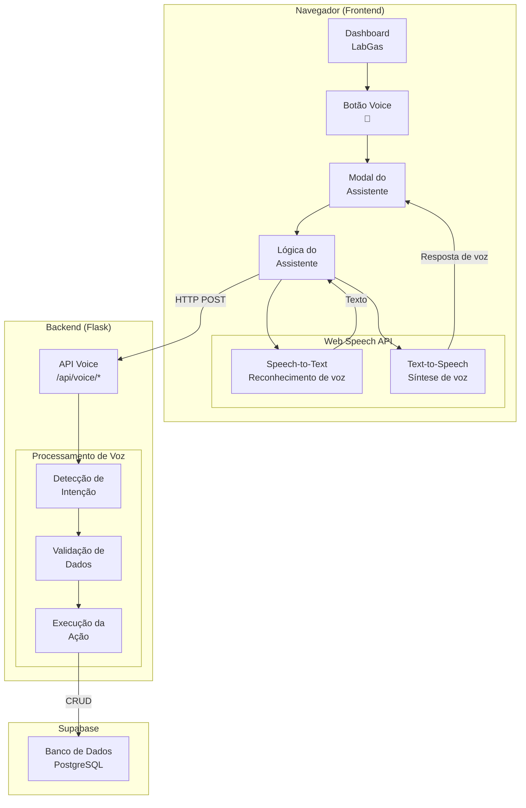
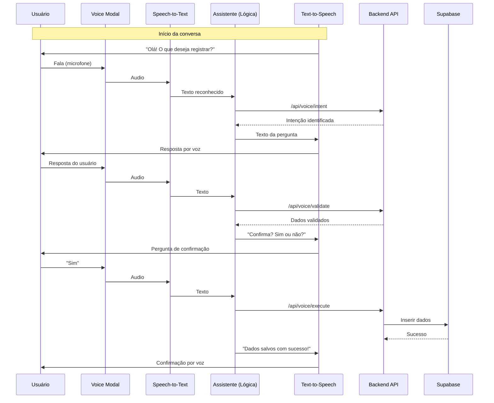

# Assistente de Voz - LabGas Manager

## Visão Geral

Sistema de assistente de voz para interação com o LabGas Manager, permitindo registro de dados (cilindros, pressão, elementos, amostras) através de comandos de voz, com respostas também em voz.

**Branch:** `feat/voice-assistant`

---

## Arquitetura da Solução



---

## Fluxo de Dados



---

## Tecnologias Gratuitas

| Tecnologia | Uso | Custo |
|------------|-----|-------|
| **Web Speech API** | Reconhecimento de voz no navegador | Gratuito |
| **Web Speech API (SpeechSynthesis)** | Síntese de voz (resposta) | Gratuito |
| **Flask (Backend)** | Processamento de comandos | Gratuito |
| **Regex/NLP simples** | Interpretação de intents | Gratuito |
| **Supabase** | Armazenamento | Gratuito (tier free) |

---

## Fluxo de Conversação

```
╔════════════════════════════════════════════════════════════════════╗
║                    ASSISTENTE DE VOZ - LABGAS                    ║
╠════════════════════════════════════════════════════════════════╣
║                                                                    ║
║  🎤 SISTEMA: "Olá! Sou seu assistente de voz do LabGas Manager." ║
║              "O que você gostaria de registrar?"                  ║
║                                                                    ║
║  📋 OPÇÕES:                                                       ║
║     1. Cilindros                                                   ║
║     2. Pressão                                                     ║
║     3. Elementos                                                   ║
║     4. Amostras                                                    ║
║                                                                    ║
║  🎤 USUÁRIO: "Quero registrar um cilindro" ou "Cilindro"         ║
║                                                                    ║
║  ═══════════════════════════════════════════════════════════════ ║
║                                                                    ║
║  🎤 SISTEMA: "Certo! Vou registrar um novo cilindro."             ║
║              "Qual é o código do cilindro?"                        ║
║              "Formato: CIL-001"                                  ║
║                                                                    ║
║  🎤 USUÁRIO: "CIL-001"                                            ║
║                                                                    ║
║  ═══════════════════════════════════════════════════════════════ ║
║                                                                    ║
║  🎤 SISTEMA: "Código CIL-001. Confirma? Diga sim ou não."        ║
║                                                                    ║
║  🎤 USUÁRIO: "Sim"                                                ║
║                                                                    ║
║  ═══════════════════════════════════════════════════════════════ ║
║                                                                    ║
║  [Continua com as próximas perguntas do formulário...]           ║
║                                                                    ║
╚════════════════════════════════════════════════════════════════════╝
```

---

## Estrutura de Arquivos a Criar

```
frontend/
├── app.py                          # Adicionar rota /voice/*
├── blueprints/
│   └── voice.py                    # [NOVO] Voice assistant logic
├── templates/
│   ├── dashboard.html              # Adicionar botão Voice
│   └── voice_modal.html            # [NOVO] Modal do assistente
└── static/
    └── js/
        └── voice_assistant.js      # [NOVO] Lógica de voz
```

```
backend/
├── app.py                          # [NOVO] API de voz
└── routes/
    └── voice.py                    # [NOVO] Rotas de voz
```

---

## Diagrama de Estados (State Machine)

```
┌──────────────┐
│   IDLE       │  ← Estado inicial, aguardando usuário
└──────┬───────┘
       │ Usuário fala
       ▼
┌──────────────┐
│  INTENT      │  ← Identifica intenção (cilindro/pressão/etc)
└──────┬───────┘
       │ Intenção identificada
       ▼
┌──────────────┐
│  COLLECTING  │  ← Coleta dados (perguntas uma a uma)
│              │    ├── Pergunta código
│              │    ├── Pergunta data
│              │    ├── Pergunta status
│              │    └── Pergunta gás/kg
└──────┬───────┘
       │ Dados coletados
       ▼
┌──────────────┐
│  CONFIRMING  │  ← Confirmação com o usuário
└──────┬───────┘
       │ Confirmação
       ▼
┌──────────────┐
│   EXECUTE    │  ← Executa ação no banco
└──────┬───────┘
       │ Sucesso/Erro
       ▼
┌──────────────┐
│   FEEDBACK   │  ← Retorna resultado por voz
└──────┬───────┘
       │ Fim ou continuar
       ▼
┌──────────────┐
│   IDLE       │  ← Volta ao início
└──────────────┘
```

---

## Endpoints da API (Backend)

| Método | Endpoint | Descrição |
|--------|----------|-----------|
| POST | `/api/voice/intent` | Identifica intenção do usuário |
| POST | `/api/voice/validate` | Valida resposta do usuário |
| POST | `/api/voice/execute` | Executa ação confirmada |
| GET | `/api/voice/state` | Retorna estado atual da conversa |
| POST | `/api/voice/reset` | Reseta conversa para início |

---

## Intenções (Intents)

| Intent | Descrição | Parâmetros |
|--------|-----------|------------|
| `registrar_cilindro` | Cadastrar novo cilindro | código, data_compra |
| `registrar_pressao` | Registrar pressão | cilindro_id, pressao |
| `registrar_elemento` | Cadastrar novo elemento | nome, consumo_lpm |
| `registrar_amostra` | Registrar análise | cilindro_id, elemento_id, tempo_chama |
| `consultar_cilindro` | Buscar informações do cilindro | código |
| `listar_cilindros` | Listar todos cilindros | - |
| `cancelar` | Cancelar operação | - |

---

## Validações de Voz

| Campo | Validação | Exemplo de Resposta do Sistema |
|-------|-----------|--------------------------------|
| Código Cilindro | Formato CIL-XXX | "Código inválido. O formato deve ser CIL-001." |
| Data | Formato de data | "Data não reconhecida. Diga a data no formato dia mês ano." |
| Pressão | 0-300 bar | "Pressão deve estar entre 0 e 300 bar. Qual o valor?" |
| Nome Elemento | Primeira maiúscula | "Nome alterado para Ferro." |
| Tempo Chama | HH:MM:SS | "Tempo inválido. Diga o tempo no formato hora minuto segundo." |

---

## Comandos de Voz Aceitos

### Afirmação
- "sim", "confirma", "correto", "certo", "ok", "yes", "y"

### Negação
- "não", "nao", "cancelar", "errado", "não confirma", "no", "n"

### Navegação
- "cilindro", "registrar cilindro", "novo cilindro"
- "pressão", "registrar pressão", "pressão do cilindro"
- "elemento", "registrar elemento", "novo elemento"
- "amostra", "registrar amostra", "nova amostra"
- "cancelar", "voltar", "menu principal"

### Números
- "um", "dois", "três", "quatro", "cinco", "seis", "sete", "oito", "nove", "dez"
- "onze", "doze", "treze", "quatorze", "quinze"
- "vinte", "trinta", "quarenta", "cinquenta"
- "cem", "mil"

---

## Interface Visual (Frontend)

### Botão no Dashboard
- Posição: Ao lado do botão "Exportar Dados"
- Ícone: Microfone (bi-mic)
- Cor: Gradiente primário (#0070b8)
- Tooltip: "Assistente de Voz"

### Modal do Assistente
```
┌─────────────────────────────────────────────────────────────┐
│  ASSISTENTE DE VOZ - LABGAS                              [X]│
│─────────────────────────────────────────────────────────────│
│                                                             │
│  🎤 ┌─────────────────────────────────────────────────────┐ │
│     │  Ouvindo...                                        │ │
│     │  🎵 (animação de ondas)                           │ │
│     └─────────────────────────────────────────────────────┘ │
│                                                             │
│  📋 Histórico da conversa:                                  │
│     → Sistema: "O que deseja registrar?"                   │
│     → Você: "Quero registrar um cilindro"                 │
│     → Sistema: "Qual o código?"                             │
│                                                             │
│  ┌─────��────────────────────────────────────────────────┐  │
│  │  [🔴 Parar]  [⏸ Pausar]  [🔊 Volume]                 │  │
│  └──────────────────────────────────────────────────────┘  │
└─────────────────────────────────────────────────────────────┘
```

---

## Cronograma de Implementação

| Fase | Descrição | Prioridade |
|------|-----------|------------|
| **Fase 1** | Configuração básica - Web Speech API + botão no dashboard | Alta |
| **Fase 2** | Estado IDLE - Início da conversa + lista de opções | Alta |
| **Fase 3** | Intent detection - Identificar intenção do usuário | Alta |
| **Fase 4** | Fluxo Cilindro - CRUD completo por voz | Alta |
| **Fase 5** | Fluxo Pressão - Registro por voz | Média |
| **Fase 6** | Fluxo Elemento - CRUD por voz | Média |
| **Fase 7** | Fluxo Amostra - Registro por voz | Média |
| **Fase 8** | Feedback visual + histórico no modal | Média |
| **Fase 9** | Testes e ajustes de usabilidade | Média |

---

## Possíveis Desafios e Soluções

| Desafio | Solução |
|---------|---------|
| Navegador não suporta Web Speech API | Exibir mensagem de alerta + fallback para texto |
| Ruído ambiente atrapalha reconhecimento | Filtro de confiança (reconhecer apenas >0.8) |
| Usuário fala muito rápido | Buffer de pausa + confirmação de entendimento |
| Diferentes sotaques/acentos | NLP flexível com sinônimos |
| Conexão instável | Cache offline + retry automático |

---

## Testes Necessários

| Teste | Navegador |
|-------|-----------|
| Suporte completo | Chrome, Edge |
| Suporte parcial | Firefox (verificar) |
| Limitações | Safari/iOS |
| Sem permissão de microfone | Testar rejeição elegante |
| Offline temporário | Verificar comportamento |

---

## Scripts de Exemplo

### Detecção de Suporte

```javascript
function isSpeechSupported() {
  return 'SpeechRecognition' in window || 'webkitSpeechRecognition' in window;
}
```

### Iniciar Reconhecimento

```javascript
const recognition = new (window.SpeechRecognition || window.webkitSpeechRecognition)();
recognition.lang = 'pt-BR';
recognition.interimResults = false;
recognition.maxAlternatives = 1;

recognition.onresult = (event) => {
  const transcript = event.results[0][0].transcript;
  processVoiceInput(transcript);
};
```

### Síntese de Voz

```javascript
function speak(text) {
  const utterance = new SpeechSynthesisUtterance(text);
  utterance.lang = 'pt-BR';
  utterance.rate = 1;
  utterance.pitch = 1;
  speechSynthesis.speak(utterance);
}
```

---

## Roadmap

- [ ] Fase 1: Configuração básica e botão no dashboard
- [ ] Fase 2: Estado IDLE e conversa inicial
- [ ] Fase 3: Identificação de intenção
- [ ] Fase 4: Fluxo completo Cilindro
- [ ] Fase 5: Fluxo Pressão
- [ ] Fase 6: Fluxo Elemento
- [ ] Fase 7: Fluxo Amostra
- [ ] Fase 8: Feedback visual
- [ ] Fase 9: Testes finais