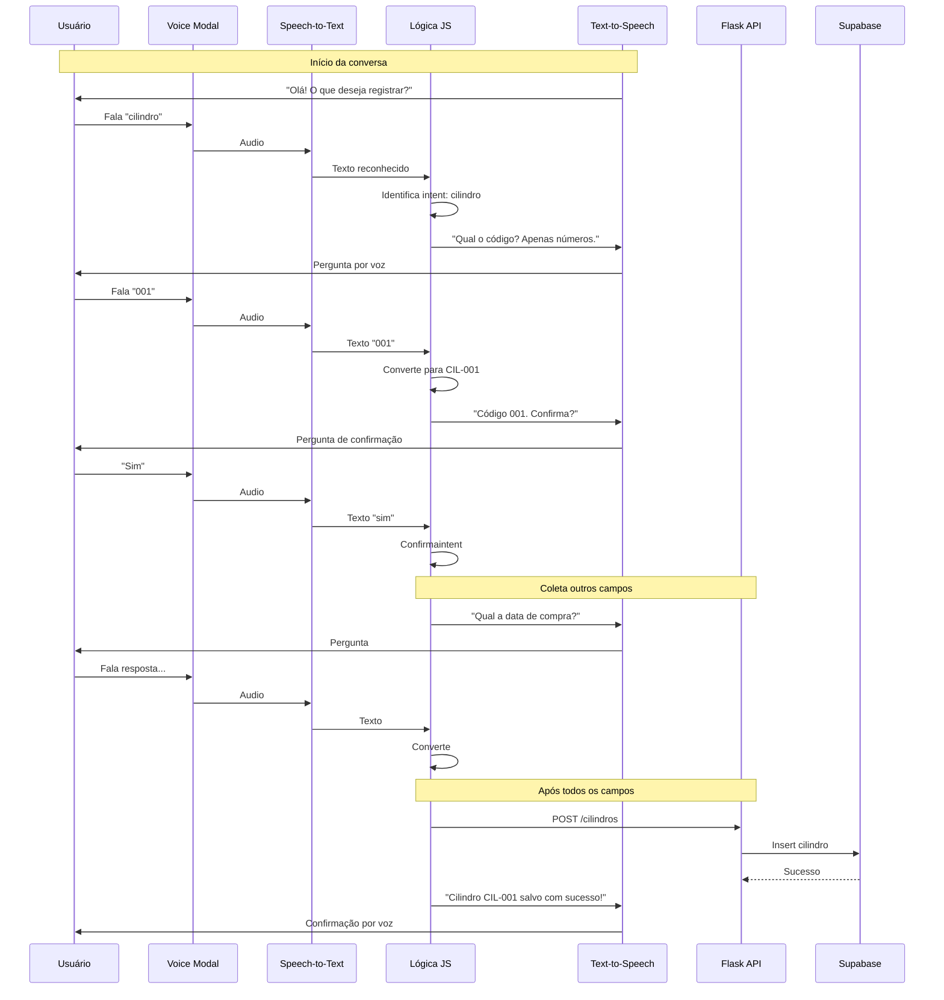

# Assistente de Voz - LabGas Manager

## Visão Geral

Sistema de assistente de voz para interação com o LabGas Manager, permitindo registro de dados (cilindros, pressão, elementos, amostras) através de comandos de voz, com respostas também em voz.

**Branch:** `feat/voice-assistant`

## Decisões de Implementação

| Decisão | Valor | Observação |
|---------|-------|-------------|
| **Processamento** | Frontend (JavaScript) | Sem API calls, mais rápido |
| **Escopo inicial** | Apenas Cilindro | Outras entidades depois |
| **Estado** | Client-side | JavaScript |
| **Fallback** | Voz + Texto | Hybrid |
| **Código cilíndro** | Ignora prefixo "CIL-", só números | "001" = CIL-001 |

---

## Fase 1: Cilindro Only (MVP)

```
┌─────────────────────────────────────────────────────────────────┐
│                    FRONTEND (Voice)                          │
├─────────────────────────────────────────────────────────────────┤
│  ┌─────────────┐    ┌──────────────┐    ┌─────────────────────┐  │
│  │  Dashboard  │───▶│ Voice Button │───▶│  Voice Assistant    │  │
│  │             │    │   (new)      │    │   Modal/Sidebar     │  │
│  └─────────────┘    └──────────────┘    └─────────┬───────────┘  │
│                                                  │              │
│  ┌──────────────────────────────────────────────▼───────────┐  │
│  │            Web Speech API (navegador)                   │  │
│  │  ┌─────────────────┐     ┌─────────────────────────────┐│  │
│  │  │ Speech-to-Text  │────▶│  Text-to-Speech (voz)       ││  │
│  │  │ (reconhecimento)│     │  (resposta do assistente)   ││  │
│  │  └─────────────────┘     └─────────────────────────────┘│  │
│  └─────────────────────────────────────────────────────────┘  │
└────────────────────────────────────────────────────────────────┘
                                │
                                ▼ Call API (Já existente)
┌─────────────────────────────────────────────────────────────────┐
│                  FLASK BACKEND                                │
├─────────────────────────────────────────────────────────────────┤
│  /cilindros (POST)        → Insere cilindro no banco          │
└─────────────────────────────────────────────────────────────────┘
```

**Notas:**
- Todo processamento de intents em JavaScript (frontend)
- Estado persistido em memória (client-side)
- Integração com rotas existentes do Flask
- Outras entidades (Pressão, Elementos, Amostras) serão implementadas **depois**

---

## Fluxo de Dados - Fase 1: Cilindro Only



---

## Tecnologias Gratuitas

| Tecnologia | Uso | Custo |
|------------|-----|-------|
| **Web Speech API** | Reconhecimento de voz no navegador | Gratuito |
| **Web Speech API (SpeechSynthesis)** | Síntese de voz (resposta) | Gratuito |
| **Flask (Backend)** | Processamento de comandos | Gratuito |
| **Regex/NLP simples** | Interpretação de intents | Gratuito |
| **Supabase** | Armazenamento | Gratuito (tier free) |

---

## Fluxo de Conversação - Cilindro Only

```
╔════════════════════════════════════════════════════════════════════╗
║                    ASSISTENTE DE VOZ - LABGAS                    ║
╠════════════════════════════════════════════════════════════════════╣
║                                                                    ║
║  🎤 SISTEMA: "Olá! Sou seu assistente de voz do LabGas Manager." ║
║              "O que você gostaria de registrar?"                  ║
║                                                                    ║
║  📋 OPÇÕES:                                                       ║
║     1. Cilindro                                                   ║
║     (mais opções depois)                                         ║
║                                                                    ║
║  🎤 USUÁRIO: "Cilindro" ou "Um"                                 ║
║                                                                    ║
║  ═══════════════════════════════════════════════════════════════ ║
║                                                                    ║
║  🎤 SISTEMA: "Certo! Vou Registrar um novo cilindro."            ║
║              "Qual é o código?Apenas os números."                ║
║              "Exemplo: zero zero um"                              ║
║                                                                    ║
║  🎤 USUÁRIO: "001" ou "um"                                       ║
║                                                                    ║
║  ═══════════════════════════════════════════════════════════════ ║
║                                                                    ║
║  🎤 SISTEMA: "Código 001. Confirma? Diga sim ou não."           ║
║                                                                    ║
║  🎤 USUÁRIO: "Sim"                                               ║
║                                                                    ║
║  ═══════════════════════════════════════════════════════════════ ║
║                                                                    ║
║  [Continua com as próximas perguntas do formulário...]           ║
║    2. Data de compra                                              ║
║    3. Gás (kg)                                                    ║
║    4. Custo                                                       ║
║    5. Status (ativo/esgotado)                                     ║
║                                                                    ║
╚════════════════════════════════════════════════════════════════════╝
```
╔════════════════════════════════════════════════════════════════════╗
║                    ASSISTENTE DE VOZ - LABGAS                    ║
╠════════════════════════════════════════════════════════════════╣
║                                                                    ║
║  🎤 SISTEMA: "Olá! Sou seu assistente de voz do LabGas Manager." ║
║              "O que você gostaria de registrar?"                  ║
║                                                                    ║
║  📋 OPÇÕES:                                                       ║
║     1. Cilindros                                                   ║
║     2. Pressão                                                     ║
║     3. Elementos                                                   ║
║     4. Amostras                                                    ║
║                                                                    ║
║  🎤 USUÁRIO: "Quero registrar um cilindro" ou "Cilindro"         ║
║                                                                    ║
║  ═══════════════════════════════════════════════════════════════ ║
║                                                                    ║
║  🎤 SISTEMA: "Certo! Vou registrar um novo cilindro."             ║
║              "Qual é o código do cilindro?"                        ║
║              "Formato: CIL-001"                                  ║
║                                                                    ║
║  🎤 USUÁRIO: "CIL-001"                                            ║
║                                                                    ║
║  ═══════════════════════════════════════════════════════════════ ║
║                                                                    ║
║  🎤 SISTEMA: "Código CIL-001. Confirma? Diga sim ou não."        ║
║                                                                    ║
║  🎤 USUÁRIO: "Sim"                                                ║
║                                                                    ║
║  ═══════════════════════════════════════════════════════════════ ║
║                                                                    ║
║  [Continua com as próximas perguntas do formulário...]           ║
║                                                                    ║
╚════════════════════════════════════════════════════════════════════╝
```

---

## Estrutura de Arquivos a Criar - Fase 1

```
frontend/
├── app.py                                   # Ja existe (adicionar rota /voice)
├── blueprints/
│   └── voz.py                               # [NOVO] Voice assistant (opcional)
├── templates/
│   ├── dashboard.html                       # [MODIFICAR] Adicionar botão Voice
│   └── voice_modal.html                     # [NOVO] Modal do assistente
└── static/
    └── js/
        └── voice_assistant.js              # [NOVO] Lógica de voz
```

**Notas da Fase 1:**
- Não cria backend/分开 - usa rotas existentes
- Integração com /cilindros (POST) existente
- Todo processamento em JavaScript (client-side)

---

## Diagrama de Estados (State Machine) - Fase 1: Cilindro Only

```
┌──────────────┐
│   IDLE       │  ← Estado inicial, aguardando usuário
└──────┬───────┘
       │ Usuário fala "cilindro" ou "um"
       ▼
┌──────────────┐
│  INTENT      │  ← Identifica intenção:cilindro
└──────┬───────┘
       │
       ▼
┌──────────────┐
│  COLLECTING  │  ← Coleta dados (perguntas uma a uma)
│              │    ├── Pergunta 1: código (número)
│              │    ├── Pergunta 2: data
│              │    ├── Pergunta 3: kg
│              │    ├── Pergunta 4: custo
│              │    └── Pergunta 5: status
└──────┬───────┘
       │ Dados coletados
       ▼
┌──────────────┐
│  CONFIRMING  │  ← Confirmação com o usuário
└──────┬───────┘
       │ Confirmação
       ▼
┌──────────────┐
│   EXECUTE    │  ← Chama API existing /cilindros
└──────┬───────┘
       │ Sucesso/Erro
       ▼
┌──────────────┐
│   FEEDBACK   │  ← Retorna resultado por voz
└──────┬───────┘
       │ Fim ou continuar
       ▼
┌──────────────┐
│   IDLE       │  ← Volta ao início
└──────────────┘
```

---

## Endpoints da API - Fase 1

|Método|Endpoint|Descrição|
|------|--------|-----------|
|POST|`/cilindros`|Insere novo cilindro (rota existente)|

**Sem novos endpoints para Fase 1:**
- Todo processamento em JavaScript (frontend)
- Integração com rota existente `/cilindros` (POST)

---

## Intenções (Intents) - Fase 1: Cilindro Only

| Intent | Descrição | Parâmetros |
|--------|-----------|------------|
| `registrar_cilindro` | Cadastrar novo cilindro | código, data_compra, gas_kg, custo, status |

**Outras intenções serão adicionadas depois:**
- `registrar_pressao` - Registrar pressão (Fase 5)
- `registrar_elemento` - Cadastrar novo elemento (Fase 6)
- `registrar_amostra` - Registrar análise (Fase 7)

---

## Validações de Voz - Fase 1

| Campo | Validação | Exemplo de Resposta do Sistema |
|-------|-----------|--------------------------------|
| Código | Apenas números (3 dígitos) | "Código 001. Certo?" |
| Data | Formato de data (dia mês ano) | "Data não reconhecida. Diga a data no formato dia mês ano." |
| Gás (kg) | Decimal | "Quantos quilos?" |
| Custo | Decimal | "Qual o valor em reais?" |
| Status | ativo/esgotado | "Status ativo ou esgotado?" |

### Conversão de Código
- Entrada: "001" → Saída: "CIL-001"
- Entrada: "um" → Saída: "CIL-001"
- Entrada: "dois" → Saída: "CIL-002"

---

## Comandos de Voz Aceitos - Fase 1: Cilindro Only

### Afirmação
- "sim", "confirma", "correto", "certo", "ok", "yes", "y", "um"

### Negação
- "não", "nao", "cancelar", "errado", "não confirma", "no", "n"

### Navegação - Fase 1
- "cilindro", "registrar cilindro", "novo cilindro", "um"

### Números (para códigos e valores)
- "zero", "um", "dois", "três", "quatro", "cinco", "seis", "sete", "oito", "nove"
- "dez", "onze", "doze", "treze", "quatorze", "quinze"
- "vinte", "trinta", "quarenta", "cinquenta"
- "cem", "mil"

### Comandos das próximas fases (depois de Cilindro)
- "pressão", "registrar pressão", "pressão do cilindro"
- "elemento", "registrar elemento", "novo elemento"
- "amostra", "registrar amostra", "nova amostra"
- "cancelar", "voltar", "menu principal"

---

## Interface Visual (Frontend)

### Botão no Dashboard
- Posição: Ao lado do botão "Exportar Dados"
- Ícone: Microfone (bi-mic)
- Cor: Gradiente primário (#0070b8)
- Tooltip: "Assistente de Voz"

### Modal do Assistente
```
┌─────────────────────────────────────────────────────────────┐
│  ASSISTENTE DE VOZ - LABGAS                              [X]│
│─────────────────────────────────────────────────────────────│
│                                                             │
│  🎤 ┌─────────────────────────────────────────────────────┐ │
│     │  Ouvindo...                                        │ │
│     │  🎵 (animação de ondas)                           │ │
│     └─────────────────────────────────────────────────────┘ │
│                                                             │
│  📋 Histórico da conversa:                                  │
│     → Sistema: "O que deseja registrar?"                   │
│     → Você: "Quero registrar um cilindro"                 │
│     → Sistema: "Qual o código?"                             │
│                                                             │
│  ┌─────��────────────────────────────────────────────────┐  │
│  │  [🔴 Parar]  [⏸ Pausar]  [🔊 Volume]                 │  │
│  └──────────────────────────────────────────────────────┘  │
└─────────────────────────────────────────────────────────────┘
```

---

## Cronograma de Implementação

|Fase|Descrição|Prioridade|Notas|
|----|-----------|------------|-------|
|**Fase 1**|Configuração básica - Web Speech API + botão no dashboard|Alta|Apenas Cilindro|
|**Fase 2**|Estado IDLE - Início da conversa + lista de opções|Alta|Apenas Cilindro|
|**Fase 3**|Intent detection - Identificar intenção do usuário|Alta|Apenas Cilindro|
|**Fase 4**|Fluxo Cilindro - CRUD completo por voz|Alta|PRIMEIRA funcionalidade completa|
|**Fase 5**|Fluxo Pressão - Registro por voz|Média|depois de Cilindro|
|**Fase 6**|Fluxo Elemento - CRUD por voz|Média|depois de Cilindro|
|**Fase 7**|Fluxo Amostra - Registro por voz|Média|depois de Cilindro|
|**Fase 8**|Feedback visual + histórico no modal|Média|depois de Cilindro|
|**Fase 9**|Testes e ajustes de usabilidade|Média|depois de Cilindro|

---

## Possíveis Desafios e Soluções

|Desafio|Solução|
|--------|---------|
|Navegador não suporta Web Speech API|Exibir mensagem de alerta + fallback para texto|
|Ruído ambiente atrapalha reconhecimento|Filtro de confiança (reconhecer apenas >0.8)|
|Usuário fala muito rápido|Buffer de pausa + confirmação de entendimento|
|Diferentes sotaques/acentos|NLP flexível com sinônimos|
|Conexão instável|Cache offline + retry automático|

**Notas:**
- Apenas Firefox e Chrome têm suporte completo ao Web Speech API
- Safari/iOS têm limitações-known
- Outras entidades serão testadas após Cilindro estar funcionando

---

## Escopo - O que NÃO faz parte da Fase 1

**Adiado para depois:**
- Registro de Pressão por voz
- Registro de Elementos por voz
- Registro de Amostras por voz
- Consulta/Listagem por voz
- Edição por voz
- Exclusão por voz
- Backend API para voz

---

## TestesNecessários

| Teste | Navegador |
|-------|-----------|
|Suporte completo|Chrome, Edge|
|Suporte parcial|Firefox (verificar)|
|Limitações|Safari/iOS|
|Sem permissão de microfone|Testar rejeição elegante|
|Offline temporário|Verificar comportamento|

---

## Scripts de Exemplo

### Detecção de Suporte

```javascript
function isSpeechSupported() {
  return 'SpeechRecognition' in window || 'webkitSpeechRecognition' in window;
}
```

### Iniciar Reconhecimento

```javascript
const recognition = new (window.SpeechRecognition || window.webkitSpeechRecognition)();
recognition.lang = 'pt-BR';
recognition.interimResults = false;
recognition.maxAlternatives = 1;

recognition.onresult = (event) => {
  const transcript = event.results[0][0].transcript;
  processVoiceInput(transcript);
};
```

### Síntese de Voz

```javascript
function speak(text) {
  const utterance = new SpeechSynthesisUtterance(text);
  utterance.lang = 'pt-BR';
  utterance.rate = 1;
  utterance.pitch = 1;
  speechSynthesis.speak(utterance);
}
```

---

## Roadmap

### Fase 1: Cilindro Only (MVP) - Em Progresso
- [ ] Fase 1: Configuração básica + botão no dashboard
- [ ] Fase 2: Estado IDLE + conversa inicial
- [ ] Fase 3: Identificação de intenção
- [ ] Fase 4: Fluxo completo Cilindro ← **PRIMEIRA funcionalidade completa**

### Fases seguintes (depois de Cilindro funcionar)
- [ ] Fase 5: Fluxo Pressão
- [ ] Fase 6: Fluxo Elemento
- [ ] Fase 7: Fluxo Amostra
- [ ] Fase 8: Feedback visual
- [ ] Fase 9: Testes finais