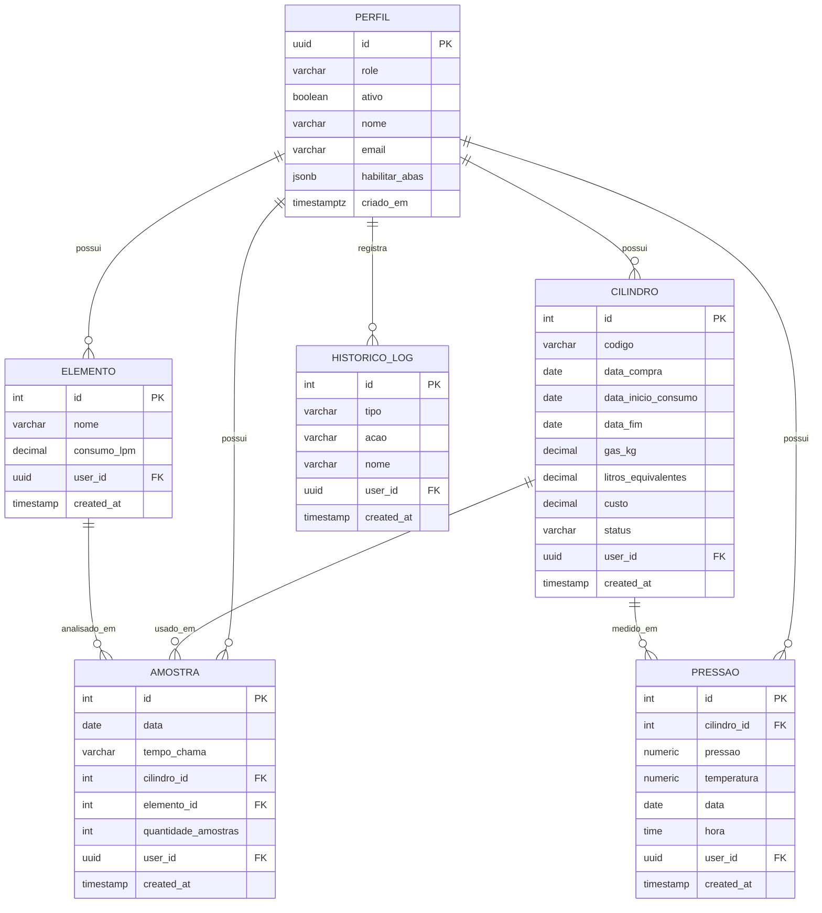
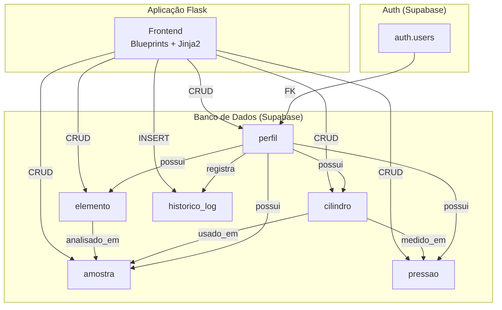

# Diagrama do Banco de Dados - LabGas Manager

## Visão Geral (ER Diagram)

## Diagrama de Fluxo de Dados

---

## Tabelas

### 1. perfil

| Campo | Tipo | Descrição |
|-------|------|-----------|
| id | UUID | PK - ID do usuário (ref auth.users) |
| role | VARCHAR(20) | 'admin' ou 'usuario' |
| ativo | BOOLEAN | Se o usuário está ativo |
| nome | VARCHAR(100) | Nome do usuário |
| email | VARCHAR(255) | Email do usuário |
| habilitar_abas | JSONB | Permissões de acesso às abas |
| criado_em | TIMESTAMP | Data de criação |

**Default:** `habilitar_abas = {"cilindro": false, "elemento": false, "amostra": false, "historico": false}`

---

### 2. cilindro

| Campo | Tipo | Descrição |
|-------|------|-----------|
| id | SERIAL | PK - ID automático |
| codigo | VARCHAR(50) | Código único (ex: CIL-001) |
| data_compra | DATE | Data de compra |
| data_inicio_consumo | DATE | Início de uso |
| data_fim | DATE | Fim de uso (opcional) |
| gas_kg | DECIMAL(5,2) | Quantidade de gás em kg |
| litros_equivalentes | DECIMAL(10,2) | Litros equivalentes (956 L/kg) |
| custo | DECIMAL(10,2) | Custo do cilindro |
| status | VARCHAR(20) | 'ativo' ou 'esgotado' |
| user_id | UUID | FK - Usuário dono |
| created_at | TIMESTAMP | Data de criação |

---

### 3. elemento

| Campo | Tipo | Descrição |
|-------|------|-----------|
| id | SERIAL | PK - ID automático |
| nome | VARCHAR(100) | Nome do elemento |
| consumo_lpm | DECIMAL(5,2) | Consumo em L/min |
| user_id | UUID | FK - Usuário dono |
| created_at | TIMESTAMP | Data de criação |

---

### 4. amostra

| Campo | Tipo | Descrição |
|-------|------|-----------|
| id | SERIAL | PK - ID automático |
| data | DATE | Data da análise |
| tempo_chama | VARCHAR(8) | Tempo de chama (HH:MM:SS) |
| cilindro_id | INTEGER | FK - Cilindro usado |
| elemento_id | INTEGER | FK - Elemento analisado |
| quantidade_amostras | INTEGER | Quantidade de amostras |
| user_id | UUID | FK - Usuário dono |
| created_at | TIMESTAMP | Data de criação |

---

### 5. pressao

| Campo | Tipo | Descrição |
|-------|------|-----------|
| id | SERIAL | PK - ID automático |
| cilindro_id | INTEGER | FK - Cilindro |
| pressao | NUMERIC | Pressão em bar |
| temperatura | NUMERIC | Temperatura em °C (opcional) |
| data | DATE | Data da medição |
| hora | TIME | Hora da medição |
| user_id | UUID | FK - Usuário dono |
| created_at | TIMESTAMP | Data de criação |

---

### 6. historico_log

| Campo | Tipo | Descrição |
|-------|------|-----------|
| id | SERIAL | PK - ID automático |
| tipo | VARCHAR(20) | Tipo: cilindro, elemento, amostra, pressao, perfil |
| acao | VARCHAR(20) | Ação: criado, atualizado, excluido |
| nome | VARCHAR(100) | Nome/identificação do item |
| user_id | UUID | FK - Usuário que executou |
| created_at | TIMESTAMP | Data/hora da ação |

---

## Relacionamentos

| De | Para | Tipo |
|----|------|------|
| cilindro.user_id | perfil.id | N:1 |
| elemento.user_id | perfil.id | N:1 |
| amostra.user_id | perfil.id | N:1 |
| amostra.cilindro_id | cilindro.id | N:1 |
| amostra.elemento_id | elemento.id | N:1 |
| pressao.user_id | perfil.id | N:1 |
| pressao.cilindro_id | cilindro.id | N:1 |
| historico_log.user_id | perfil.id | N:1 |

---

## Políticas RLS

Todas as tabelas possuem Row Level Security (RLS) habilitado:

| Tabela | SELECT | INSERT | UPDATE | DELETE |
|--------|--------|--------|--------|--------|
| cilindro | Público | Próprio usuário | Próprio usuário | Próprio usuário |
| elemento | Público | Próprio usuário | Próprio usuário | Próprio usuário |
| amostra | Público | Próprio usuário | Próprio usuário | Próprio usuário |
| perfil | Próprio usuário | Próprio usuário | Próprio usuário | - |
| pressao | Público | Próprio usuário | Próprio usuário | Próprio usuário |
| historico_log | Público | Admin (service_role) | - | - |
